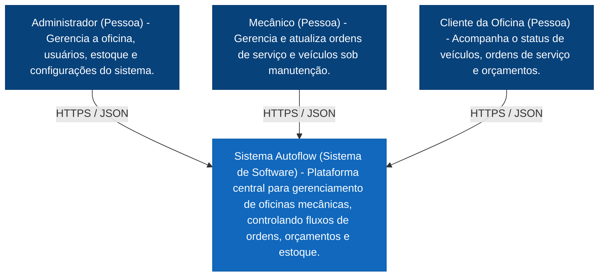
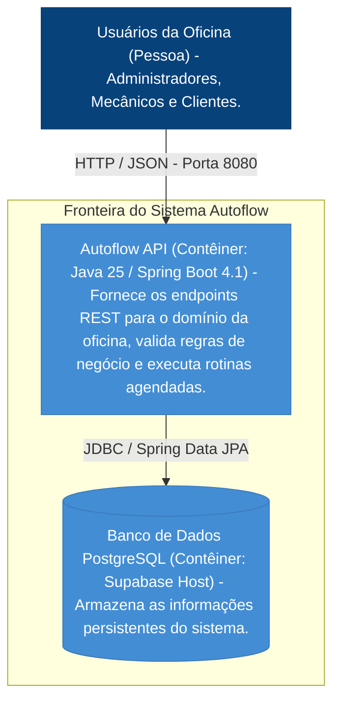
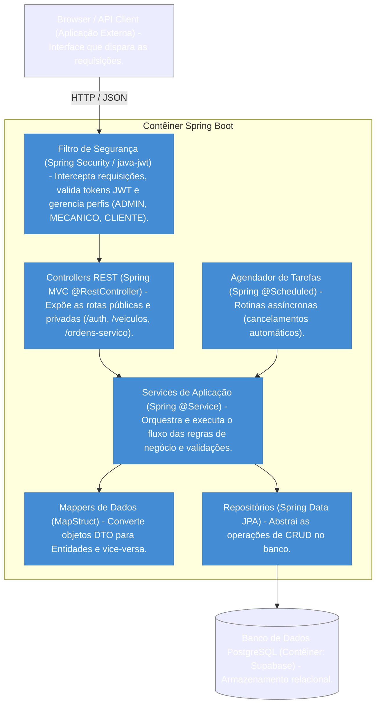

# 🏛️ Documentação Arquitetural - Sistema Autoflow

Este documento descreve a arquitetura de software do sistema **Autoflow** utilizando a metodologia do **Modelo C4** com gráficos renderizados via Mermaid.

---

## 🗺️ Nível 1: Contexto do Sistema (System Context)

O Autoflow é uma plataforma centralizada para o gerenciamento de oficinas mecânicas. Neste nível macro, o sistema é tratado como uma caixa preta única, detalhando apenas como os atores interagem com ele.

---

## 📦 Nível 2: Contêineres (Containers)

Neste nível, dividimos o Sistema Autoflow nas suas aplicações executáveis e armazenamentos de dados reais encontrados no repositório do projeto.

---

## 🧩 Nível 3: Componentes (Components)

Detalhamento interno do contêiner **Autoflow API**, demonstrando como as pastas e pacotes estruturais do Spring Boot se comunicam internamente.

---

## Nível 4 : Código

Este documento representa o mapeamento detalhado do código atual da API, com foco no nível C4 (código). Ele descreve as classes principais, atributos, métodos relevantes, relações entre classes e os fluxos de execução mais importantes do sistema.

## 1. Visão geral da arquitetura

A API está organizada em camadas bem definidas:

- Domain model: entidades JPA e enums do negócio
- Domain repository: interfaces de persistência com JPA
- Application service: regras de negócio e orquestração
- Application dto: objetos de entrada/saída da API
- Infrastructure mapper: conversão entre DTO e entidade
- Interfaces controller: endpoints REST
- Infrastructure security: autenticação/autorização via JWT
- Exceptions: tratamento centralizado de erros

A arquitetura segue um padrão MVC/clean-ish, com foco em Spring Boot + JPA + Spring Security.

---

## 2. Entidades do domínio

### 2.1 Cliente
Package: `br.com.autoflow.domain.model`

Atributos:
- `UUID id`
- `String nome`
- `String documento`
- `String email`
- `LocalDate dataNascimento`
- `String telefone`
- `Genero genero`
- `Endereco endereco`

Relacionamentos:
- `@ManyToOne` com `Endereco`
- `@OneToMany` com veículos e ordens de serviço, conforme o modelo JPA

Métodos principais:
- Não há lógica de negócio complexa no modelo; a entidade funciona como estrutura principal de cliente.

---

### 2.2 Endereco
Atributos:
- `UUID id`
- `String cep`
- `String uf`
- `String cidade`
- `String bairro`
- `String logradouro`
- `String numero`
- `String complemento`

Observações:
- Estrutura essencial para cadastro de cliente e funcionário.
- Pode ser usada por múltiplas entidades conforme a relação JPA.

---

### 2.3 Funcionario
Atributos:
- `UUID idFuncionario`
- `String cpf`
- `String nome`
- `String telefone`
- `String email`
- `Genero genero`
- `LocalDate dataNascimento`
- `Cargo cargo`
- `Endereco endereco`
- `boolean ocupado`
- `int nr_advertencias`

Métodos principais:
- `void ocupar()`
    - marca `ocupado = true`
- `void liberar()`
    - marca `ocupado = false`
- `void adicionarAdvertencia()`
    - incrementa `nr_advertencias`
- `boolean deveSerDemitido()`
    - retorna `true` quando `nr_advertencias >= 3`

Responsabilidade:
- Representa o colaborador que executa serviços/diagnósticos e pode ser vinculado a uma conta de usuário.

---

### 2.4 Usuario
Package: `br.com.autoflow.domain.model`

Atributos:
- `UUID id`
- `String login`
- `String senha`
- `Perfil perfil`
- `Cliente cliente`
- `Funcionario funcionario`

Implementa:
- `UserDetails`

Métodos/overrides importantes:
- `Collection<? extends GrantedAuthority> getAuthorities()`
    - traduz o `Perfil` para roles Spring Security, por exemplo `ROLE_ADMIN`, `ROLE_FUNCIONARIO`, `ROLE_CLIENTE`
- `String getUsername()`
- `String getPassword()`
- `boolean isAccountNonExpired()`
- `boolean isAccountNonLocked()`
- `boolean isCredentialsNonExpired()`
- `boolean isEnabled()`

Métodos auxiliares:
- `static Usuario criarUsuarioParaFuncionario(Funcionario funcionario, Perfil perfil, PasswordEncoder passwordEncoder)`
- `void atualizarDadosAcesso(String novoEmail, Perfil novoPerfil)`

Responsabilidade:
- Entidade de autenticação e autorização do sistema.

---

### 2.5 Veiculo
Atributos:
- `UUID idVeiculo`
- `String placa`
- `String modelo`
- `String marca`
- `BigDecimal kmAtual`
- `Integer anoFabricacao`
- `String cor`
- `Cliente cliente`

Métodos principais:
- `void atualizarDados(VeiculoRequest request, Cliente cliente)`
    - atualiza os dados do veículo para o cliente informado

Responsabilidade:
- Representa o automóvel relacionado a um cliente e a uma OS.

---

### 2.6 Servico
Atributos:
- `UUID idServico`
- `String dsServico`
- `BigDecimal vlServico`
- `Integer qtTempoEstimadoMin`

Responsabilidade:
- Define o catálogo de serviços disponíveis para orçamento e OS.

---

### 2.7 Estoque
Atributos:
- `UUID id`
- `String nomeItem`
- `String nomeMarca`
- `BigDecimal valorUnitario`
- `Integer quantidadeEstoque`
- `Integer quantidadeMinima`
- `TipoItemEstoque tipoCategoria`

Métodos principais:
- `boolean deveDispararAlertaEstoqueBaixo()`
    - retorna `true` quando:
        - `quantidadeEstoque <= quantidadeMinima`
        - e `tipoCategoria` pertence a `INSUMO` ou `PECA_COMPARTILHADA`
- `boolean deveGerarAlertaEstoqueBaixo()`
    - delega para `deveDispararAlertaEstoqueBaixo()`

Responsabilidade:
- Regra central de estoque mínimo e alerta de baixo estoque.

---

### 2.8 Orcamento
Atributos:
- `UUID id`
- `TipoOrcamento tipoOrcamento`
- `StatusOrcamento status`
- `LocalDateTime dataCriacao`
- `LocalDateTime dataExpiracao`
- `LocalDateTime dataDecisao`
- `BigDecimal subtotalPecas`
- `BigDecimal maoObra`
- `BigDecimal total`
- `OrdemServico ordemServico`
- `List<OrcamentoServico> servicos`
- `List<OrcamentoItem> itens`

Métodos principais:
- `void aprovar()`
    - valida transição e altera status para APROVADO
    - atualiza `dataDecisao`
- `void recusar()`
    - altera status para RECUSADO
- `void expirar()`
    - altera status para CANCELADO/EXPIRADO conforme regra da aplicação
- `void aplicarNovoStatus(StatusOrcamento novoStatus)`
    - encapsula o fluxo de mudança de status
- `void atualizarStatusReservaItens(StatusReservaEstoque status)`
    - percorre os itens para ajustar a reserva
- `void validarMudancaStatus()`
    - valida regras antes de alterar status
- `void recalcularTotais()`
    - recalcula subtotal e total

Observações:
- A entidade representa o orçamento e está conectada com a ordem de serviço.
- Ela também manipula itens e serviços do orçamento.

---

### 2.9 OrcamentoServico
Atributos:
- `UUID id`
- `BigDecimal maoDeObra`
- `Servico servico`
- `List<OrcamentoItem> itens`
- `Orcamento orcamento`

Métodos principais:
- `void setOrcamento(Orcamento orcamento)`
    - liga o serviço ao orçamento e repassa a referência para os itens

Responsabilidade:
- Representa um serviço incluído no orçamento.

---

### 2.10 OrcamentoItem
Atributos:
- `UUID id`
- `StatusReservaEstoque statusReserva`
- `Integer quantidade`
- `BigDecimal valorUnitario`
- `BigDecimal valorTotal`
- `UUID idEstoque`
- `OrcamentoServico orcamentoServico`
- `Orcamento orcamento`

Métodos principais:
- `void calcularTotal()`
    - calcula `valorTotal = valorUnitario * quantidade`

Observações:
- O campo `idEstoque` é um UUID, não uma relação JPA direta com a entidade `Estoque`.
- Isso exige busca manual no repositório do estoque, ao invés de relacionamento objeto-a-objeto.

---

### 2.11 OrdemServico
Atributos principais:
- `UUID idOs`
- `StatusOS statusOS`
- `String dsRelatoCliente`
- `String dsDiagnostico`
- `boolean stTermoAceito`
- `LocalDateTime dtAceiteTermo`
- `BigDecimal nrKmEntrada`
- `LocalDateTime dtAberturaOs`
- `LocalDateTime dtInicioDiagnostico`
- `LocalDateTime dtFimDiagnostico`
- `LocalDateTime dtAprovacaoOrcamento`
- `LocalDateTime dataInicioExecucao`
- `LocalDateTime dataFimExecucao`
- `LocalDateTime dtEncerramentoOs`
- `LocalDateTime dtReagendamentoOs`
- `StatusPagamento stPagamento`
- `String dsMotivoCancelamento`
- `BigDecimal taxaPermanencia`
- `UUID idCliente`
- `UUID idVeiculo`
- `UUID idFuncionario`
- `List<Orcamento> idsOrcamento`
- `List<OsServico> servicosExecucao`

Métodos principais:
- `void prePersist()`
    - inicializa data de abertura, pagamento e taxa
- `void carregarServicosDosOrcamentosAprovados()`
    - carrega serviços vinculados aos orçamentos aprovados
- `void atualizarStatus(StatusOS novoStatus, String observacao)`
    - valida transições e altera os estados
- `Long getTempoTotalExecucaoMinutos()`
- `Long getTempoTotalEstimadoMinutos()`
- `Long getDiferencaMinutos()`
- `void aprovarOrcamentosVinculados(LocalDateTime dataAprovacao)`
- `void recusarOrcamentosVinculados()`
- `void verificarCancelamentoAutomatico(int diasLimite, BigDecimal valorDiaria)`
- `void verificarAbandonoTecnico(int diasLimiteAbandono)`

Responsabilidade:
- É o centro do processo operacional: recebe o cliente, vincula veículo, envolve orçamentos e serviços e controla o ciclo da ordem de serviço.

---

### 2.12 OsServico
Atributos:
- `UUID id`
- `OrdemServico ordemServico`
- `Servico servico`
- `LocalDateTime dataInicioExecucao`
- `LocalDateTime dataFimExecucao`

Responsabilidade:
- Representa a execução de um serviço dentro de uma ordem de serviço.

---

## 3. Enums do sistema
Os enums principais estão em `br.com.autoflow.domain.enums`.

Principais enums:
- `StatusOS`: estados da ordem de serviço
- `StatusOrcamento`: PENDENTE, APROVADO, RECUSADO, CANCELADO, EXPIRADO
- `StatusReservaEstoque`: RESERVADO, DISPONIVEL, VENDIDO, CANCELADO
- `TipoItemEstoque`: INSUMO, PECA_COMPARTILHADA, OUTRO
- `Perfil`: ADMIN, CLIENTE, FUNCIONARIO, MECANICO
- `Cargo`: cargos funcionais do sistema
- `Genero`
- `TipoOrcamento`
- `StatusPagamento`

Esses enums controlam regras de negócio e permissões do sistema.

---

## 4. Repositórios
Todos os repositórios estendem `JpaRepository<T, UUID>`.

### 4.1 EstoqueRepository
Métodos:
- `List<Estoque> findByNomeItemContainingIgnoreCase(String nome)`

Responsabilidade:
- Acesso ao estoque por nome.

---

### 4.2 OrcamentoRepository
Métodos:
- `boolean existsByIdAndOrdemServicoIsNotNull(UUID idOrcamento)`
- `List<Orcamento> findByOrdemServicoIdOs(UUID idOs)`
- `void deletarItensDiretosPorOrcamento(UUID id)`
- `void deletarItensPorServicosDoOrcamento(UUID id)`
- `void deletarServicosPorOrcamento(UUID id)`

Responsabilidade:
- Persistência e limpeza de itens/serviços do orçamento.

---

### 4.3 OrdemServicoRepository
Responsabilidade:
- Consultas relacionadas a métricas, histórico por veículo e filtros por status.

Métodos típicos:
- filtros por status
- histórico do veículo
- contagem por status
- métricas da OS

---

### 4.4 Outros repositórios
Há ainda os repositórios para:
- `ServicoRepository`
- `VeiculoRepository`
- `FuncionarioRepository`
- `ClienteRepository`
- `UsuarioRepository`
- `EnderecoRepository`
- `OrcamentoItemRepository`
- `OrcamentoServicoRepository`
- `OsServicoRepository`

Todos seguem o padrão JPA CRUD com consultas extras conforme necessário.

---

## 5. DTOs (Data Transfer Objects)
Os DTOs ficam em `br.com.autoflow.application.dto`.

### 5.1 DTOs da API de estoque
- `EstoqueRequest`
- `EstoqueResponse`
- `AdicionarEstoqueRequest`
- `AtualizarValorEstoqueRequest`

### 5.2 DTOs de orçamento
- `OrcamentoRequest`
- `OrcamentoResponse`
- `OrcamentoItemRequest`
- `OrcamentoItemResponse`
- `OrcamentoServicoRequest`
- `OrcamentoServicoResponse`
- `AtualizarStatusOrcamentoRequest`

### 5.3 DTOs de ordem de serviço
- `OrdemServicoRequest`
- `OrdemServicoResponse`
- `AtualizarStatusOSRequest`
- `AtualizarStatusPagamentoRequest`
- `MetricaOsResponse`
- `HistoricoVeiculoResponse`

### 5.4 DTOs de autenticação
- `LoginRequest`
- `TokenResponse`

### 5.5 DTOs de serviço e veículo
- `ServicoRequest`
- `ServicoResponse`
- `VeiculoRequest`
- `VeiculoResponse`
- `FuncionarioRequest`
- `FuncionarioResponse`

Função:
- encapsular dados de entrada e saída dos endpoints REST

---

## 6. Mappers
Os mappers ficam em `br.com.autoflow.infrastructure.mapper` e em sua maioria usam MapStruct.

Mappers importantes:
- `EstoqueMapper`
- `OrcamentoMapper`
- `OrcamentoItemMapper`
- `OrcamentoServicoMapper`
- `OrdemServicoMapper`
- `ServicoMapper`
- `VeiculoMapper`
- `FuncionarioMapper`
- `ClienteMapper`
- `EnderecoMapper`
- `OsServicoMapper`

Função:
- converter entre entidade e DTO
- implementar atualização parcial de objetos

---

## 7. Services

### 7.1 EstoqueService
Atributos/dependências:
- `EstoqueRepository estoqueRepository`
- `EstoqueMapper estoqueMapper`

Métodos principais:
- `EstoqueResponse criar(EstoqueRequest request)`
- `List<EstoqueResponse> listarTodos()`
- `EstoqueResponse buscarPorId(UUID id)`
- `EstoqueResponse adicionarQuantidade(UUID id, AdicionarEstoqueRequest request)`
- `EstoqueResponse atualizarValorUnitario(UUID id, AtualizarValorEstoqueRequest request)`
- `EstoqueResponse atualizar(UUID id, EstoqueRequest request)`
- `List<EstoqueResponse> listarInsumosComEstoqueBaixo()`
- `void reservarEstoqueParaItens(List<OrcamentoItemRequest> itens)`
- `void devolverEstoqueDeItens(List<OrcamentoItemRequest> itens)`

Responsabilidade:
- Gestão do estoque: cadastro, ajuste, reserva e conferência de itens em nível crítico.

---

### 7.2 OrcamentoService
Dependências:
- `OrcamentoRepository orcamentoRepository`
- `OrcamentoMapper orcamentoMapper`
- `OrdemServicoRepository ordemServicoRepository`
- `EstoqueRepository estoqueRepository`
- `OrcamentoExpiradoService orcamentoExpiradoService`

Métodos principais:
- `OrcamentoResponse criar(OrcamentoRequest request)`
- `List<OrcamentoResponse> listarTodos()`
- `OrcamentoResponse buscarPorId(UUID id)`
- `List<OrcamentoResponse> listarPorOrdemServico(UUID idOs)`
- `void delete(UUID id)`
- `OrcamentoResponse atualizarStatus(UUID id, AtualizarStatusOrcamentoRequest request)`
- `void deduzirItensDoEstoque(Orcamento orcamento)`
- `List<String> verificarAvisosEstoque(Orcamento orcamento)`
- `OrcamentoResponse mapToResponseComAvisos(Orcamento orcamento)`

Fluxo de negócio:
1. A API recebe um orçamento
2. O sistema monta a entidade com itens e serviços
3. O status inicial é `PENDENTE`
4. Quando o orçamento é aprovado, o sistema valida o estoque e faz a dedução das quantidades
5. Caso o estoque passe a ficar baixo, gera avisos na resposta do orçamento

Responsabilidade:
- Núcleo do processo de aprovação e controle dos itens orçados.

---

### 7.3 OrdemServicoService
Dependências:
- `OrdemServicoRepository ordemServicoRepository`
- `OrdemServicoMapper ordemServicoMapper`
- `FuncionarioRepository funcionarioRepository`
- `OrcamentoService orcamentoService`

Métodos principais:
- `List<OrdemServicoResponse> listarTodas()`
- `OrdemServicoResponse buscarPorId(UUID id)`
- `OrdemServicoResponse criar(OrdemServicoRequest request, boolean agendamento)`
- `OrdemServicoResponse atualizar(UUID id, OrdemServicoRequest request)`
- `void atualizarStatusPagamento(UUID id, StatusPagamento pagamento)`
- `void deletar(UUID id)`
- `OrdemServicoResponse atualizarStatus(UUID id, AtualizarStatusOSRequest request)`
- `MetricaOsResponse obterMetricasPorOS(UUID idOs)`
- `Page<MetricaOsResponse> buscarMetricasComFiltro(...)`
- `List<HistoricoVeiculoResponse> obterHistoricoPorVeiculo(UUID idVeiculo)`
- `void processarCancelamentosAutomaticos()`

Responsabilidade:
- Gerencia o ciclo de vida da ordem de serviço e a integração com orçamento, pagamento e operação técnica.

---

### 7.4 ServicoService
Métodos principais:
- `ServicoResponse criar(ServicoRequest request)`
- `Page<ServicoResponse> listarTodos(Pageable pageable)`
- `ServicoResponse buscarPorId(UUID id)`
- `ServicoResponse atualizar(UUID id, ServicoRequest request)`
- `void deletar(UUID id)`

Responsabilidade:
- CRUD do catálogo de serviços.

---

### 7.5 VeiculoService
Métodos principais:
- `VeiculoResponse criar(VeiculoRequest request)`
- `List<VeiculoResponse> listar()`
- `VeiculoResponse buscarPorId(UUID id)`
- `VeiculoResponse atualizar(UUID id, VeiculoRequest request)`
- `void deletar(UUID id)`

Responsabilidade:
- CRUD de veículos por cliente.

---

### 7.6 FuncionarioService
Métodos principais:
- `FuncionarioResponse criar(FuncionarioRequest request)`
- `List<FuncionarioResponse> listar()`
- `FuncionarioResponse buscar(UUID id)`
- `FuncionarioResponse atualizar(UUID id, FuncionarioRequest request)`
- `void deletar(UUID id)`
- `String registrarAdvertencia(UUID id)`

Responsabilidade:
- Cadastro e gestão de funcionários, incluindo advertências e possíveis penalidades.

---

### 7.7 OrcamentoExpiradoService
Responsabilidade:
- Registrar/gerenciar orçamentos expirados.

---

## 8. Controllers REST

### 8.1 AutoController / autenticação
Endpoint:
- `POST /auth/login`

Responsabilidade:
- autentica usuário e retorna token JWT.

---

### 8.2 EstoqueController
Base path: `/estoque`

Endpoints:
- `POST /estoque` -> criar
- `GET /estoque` -> listar todos
- `GET /estoque/{id}` -> buscar por ID
- `PATCH /estoque/{id}/adicionar-quantidade` -> soma quantidade
- `PATCH /estoque/{id}/valor-unitario` -> atualiza valor unitário
- `PUT /estoque/{id}` -> atualizar registro

---

### 8.3 OrcamentoController
Base path: `/orcamentos`

Endpoints:
- `POST /orcamentos` -> criar orçamento
- `GET /orcamentos` -> listar todos
- `GET /orcamentos/{id}` -> buscar por ID
- `DELETE /orcamentos/{id}` -> remover
- `PATCH /orcamentos/{id}/status` -> atualizar status
- `GET /orcamentos/ordem-servico/{idOs}` -> listar por ordem de serviço

---

### 8.4 OrdemServicoController
Base path: `/ordens-servico`

Endpoints:
- `GET /ordens-servico`
- `GET /ordens-servico/{id}`
- `POST /ordens-servico?agendamento=false`
- `PUT /ordens-servico/{id}`
- `PATCH /ordens-servico/{id}/status`
- `PATCH /ordens-servico/{id}/pagamento`
- `GET /ordens-servico/{idOs}/metricas`
- `GET /ordens-servico/metricas`
- `GET /ordens-servico/veiculo/{idVeiculo}/historico`
- `DELETE /ordens-servico/{id}`
- `POST /ordens-servico/processar-cancelamentos`

---

### 8.5 ServicoController
Base path: `/servicos`

Endpoints:
- `POST /servicos`
- `GET /servicos`
- `GET /servicos/{id}`
- `PUT /servicos/{id}`
- `DELETE /servicos/{id}`

---

### 8.6 VeiculoController
Base path: `/veiculos`

Endpoints:
- `POST /veiculos`
- `GET /veiculos`
- `GET /veiculos/{id}`
- `PUT /veiculos/{id}`
- `DELETE /veiculos/{id}`

---

### 8.7 FuncionarioController
Base path: `/funcionarios`

Endpoints:
- `POST /funcionarios`
- `GET /funcionarios`
- `GET /funcionarios/{id}`
- `PUT /funcionarios/{id}`
- `DELETE /funcionarios/{id}`
- `PATCH /funcionarios/{id}/advertencia`

---

## 9. Segurança: JWT, filtros e autorização

### 9.1 TokenService
Atributos:
- `String secret`
- `Long expirationMinutes`

Métodos principais:
- `String gerarToken(Usuario usuario)`
    - cria JWT com claims relevantes
    - inclui perfil do usuário e informações como clienteId e funcionarioId
- `String validarToken(String token)`
    - valida assinatura e expiração do token

Responsabilidade:
- gerar e validar credenciais JWT para autenticação da API.

---

### 9.2 SecurityFilter
Métodos principais:
- `String recuperarToken(HttpServletRequest request)`
    - lê o header `Authorization`
    - extrai token no padrão `Bearer <token>`
- `doFilterInternal(HttpServletRequest request, HttpServletResponse response, FilterChain chain)`
    - valida token
    - busca usuário pelo login
    - preenche `SecurityContext` para autenticação do Spring Security

Responsabilidade:
- aplicar autenticação em todas as requisições que chegam na API.

---

### 9.3 SecurityConfigurations
Responsabilidade:
- define as regras de autorização e endpoints públicos.

Exemplo de regra:
- `POST /auth/login` -> público
- `DELETE /**` -> somente `ADMIN`
- endpoint de operação e consulta -> regras por perfil
- restante -> autenticado

---

## 10. Exceções e tratamento global
Principais exceções:
- `RegraNegocioException`
- `EntidadeNaoEncontradaException`
- `EnderecoNaoEncontradoException`
- `EmailJaCadastradoException`
- `DadosJaCadastradosException`

Tratamento:
- `GlobalExceptionHandler`
    - converte exceções em resposta HTTP padronizada
    - encapsula message, status, timestamp e detalhes

---

## 11. Fluxo principal: criação e aprovação de orçamento

### 11.1 Fluxo de criação
1. `POST /orcamentos` chama `OrcamentoController.criar(request)`
2. `OrcamentoService.criar(request)` recebe a demanda
3. O service monta a entidade `Orcamento`
4. Os itens e serviços são ligados ao orçamento
5. O status inicial fica `PENDENTE`
6. O sistema retorna `OrcamentoResponse`

### 11.2 Fluxo de aprovação
1. `PATCH /orcamentos/{id}/status` chama `OrcamentoController.atualizarStatus()`
2. `OrcamentoService.atualizarStatus(id, request)` busca o orçamento
3. Valida a transição de status
4. Se status for `APROVADO`, chama `deduzirItensDoEstoque(orcamento)`
5. O service percorre os itens do orçamento e reduz a quantidade em `Estoque`
6. Se a quantidade ficar no limite mínimo ou abaixo, gera avisos de estoque
7. O orçamento recebe status aprovado e é salvo

### 11.3 Fluxo de reserva
- Na criação do orçamento, o item pode entrar como `RESERVADO`
- Durante a aprovação, o item pode ser convertido para `VENDIDO` após dedução do estoque
- Se houver reversão, `EstoqueService.devolverEstoqueDeItens(...)` pode reverter o movimento

---

## 12. Fluxo principal: ordem de serviço
1. `POST /ordens-servico` cria uma OS com cliente/veículo e dados iniciais
2. A OS pode receber orçamentos vinculados
3. A aprovação do orçamento influencia o estado da OS
4. `OrdemServicoService.atualizarStatus()` valida a transição de etapas
5. Quando a OS avança para execução, o sistema aloca os serviços e controla tempos
6. Em conclusão, pode ocorrer atualização de pagamento/encerramento

---

## 13. Conexões entre classes principais

Diagrama conceitual das relações:

- `Cliente` -> `Endereco`
- `Usuario` -> `Cliente`
- `Usuario` -> `Funcionario`
- `Funcionario` -> `Endereco`
- `Veiculo` -> `Cliente`
- `OrdemServico` -> `Cliente` (via idCliente) e `Veiculo` (via idVeiculo)
- `OrdemServico` -> `Orcamento` (OneToMany)
- `Orcamento` -> `OrcamentoServico` (OneToMany)
- `OrcamentoServico` -> `Servico`
- `OrcamentoServico` -> `OrcamentoItem` (OneToMany)
- `OrcamentoItem` -> `UUID idEstoque`
- `Estoque` -> alerta e quantidade de itens
- `Controller` -> `Service`
- `Service` -> `Repository`
- `Service` -> `Mapper`
- `SecurityFilter` -> `TokenService`
- `TokenService` -> `UsuarioRepository`

---

## 14. Conclusão

O código atual da API apresenta uma estrutura bem organizada em camadas, com foco em:

- gestão de clientes, veículos, funcionários e serviços
- controle de orçamentos e ordens de serviço
- estoque e regras de baixo estoque
- autenticação e autorização via JWT
- gestão de status e transições do processo operacional

As classes centrais são:
- `OrdemServico`
- `Orcamento`
- `Estoque`
- `Funcionario`
- `Usuario`
- `TokenService`
- `OrcamentoService`
- `OrdemServicoService`
- `EstoqueService`

Essas classes formam o núcleo funcional do sistema e são os pontos principais para explicar a lógica de negócio no trabalho de documentação.

---