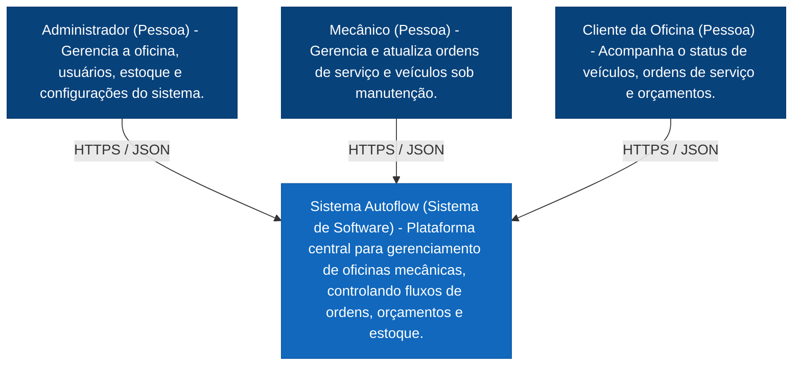
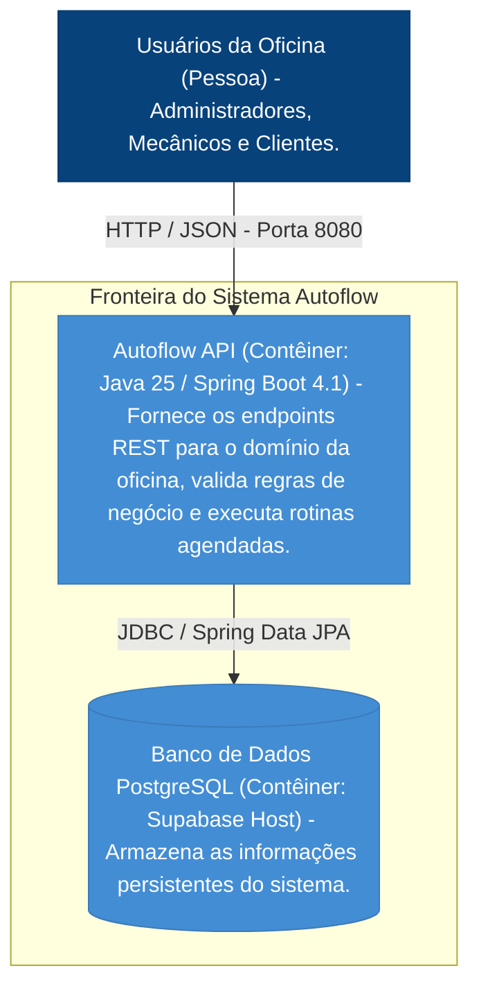
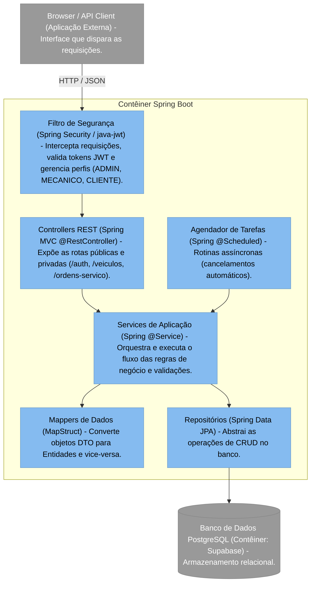

# 🏛️ Documentação Arquitetural - Sistema Autoflow

Este documento descreve a arquitetura de software do sistema **Autoflow** utilizando a metodologia do **Modelo C4** com gráficos renderizados via Mermaid.

---

## 🗺️ Nível 1: Contexto do Sistema (System Context)

O Autoflow é uma plataforma centralizada para o gerenciamento de oficinas mecânicas. Neste nível macro, o sistema é tratado como uma caixa preta única, detalhando apenas como os atores interagem com ele.

---

## 📦 Nível 2: Contêineres (Containers)

Neste nível, dividimos o Sistema Autoflow nas suas aplicações executáveis e armazenamentos de dados reais encontrados no repositório do projeto.

---

## 🧩 Nível 3: Componentes (Components)

Detalhamento interno do contêiner **Autoflow API**, demonstrando como as pastas e pacotes estruturais do Spring Boot se comunicam internamente.

---

## 🔍 4. Lacunas Técnicas e Próximos Passos [TODO]

As seguintes definições arquiteturais não puderam ser extraídas diretamente do código-fonte e precisam ser validadas manualmente:

* 🔐 **[TODO: SEGURANÇA DE CREDENCIAIS]**: Mapear onde a senha de produção do banco de dados (oculta no `application.properties`) será armazenada (ex: AWS Secrets Manager, variáveis de ambiente do Supabase).
* 🚀 **[TODO: INFRAESTRUTURA E DEPLOY]**: O projeto possui um `Dockerfile` expondo a porta `8080`, mas falta documentar o ambiente onde esse contêiner rodará (ex: AWS ECS, Kubernetes, Render).
* 📧 **[TODO: INTEGRAÇÕES EXTERNAS]**: Mapear se haverá serviços de terceiros integrados no futuro (ex: APIs de envio de e-mail ou WhatsApp para avisar o cliente sobre o fim de uma Ordem de Serviço).
