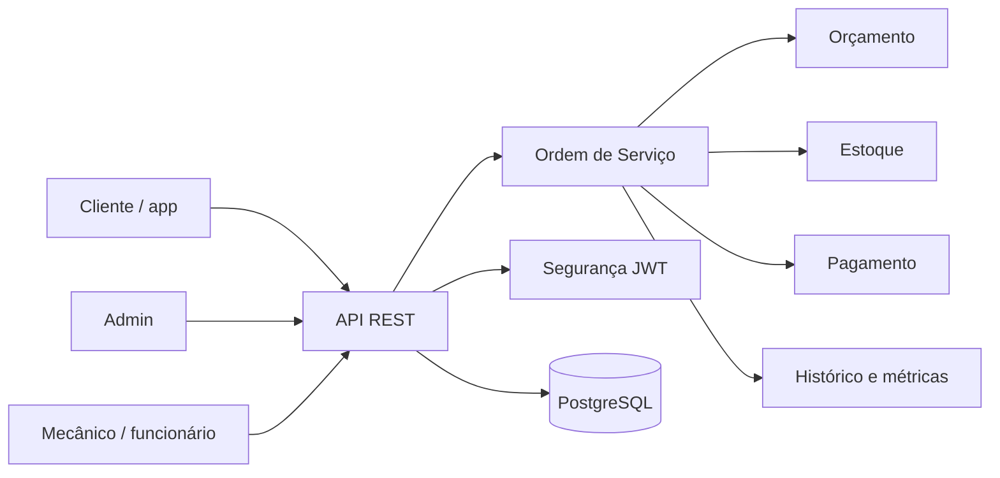

# AutoFlow


_Sistema para gerenciamento dos processos de uma oficina mecânica, centralizando o ciclo de vida das Ordens de Serviço (OS), desde a abertura até a entrega do veículo._

---

## 🗄️ Seções do Documento

| Seção                                             | Subseções                                                                                |
| ------------------------------------------------- | ---------------------------------------------------------------------------------------- |
| [🎯 Visão Geral](#-visão-geral)                   | [Objetivo](#objetivo-do-sistema), [Stack](#stack-tecnológica), [Fluxo](#fluxo-principal) |
| [🏗️ Arquitetura](#-arquitetura)                   | [Estrutura](#estrutura-da-solucao), [Diagrama](#diagrama-de-alto-nível)                  |
| [💼 Regras de Negócio](#-regras-de-negócio)       | [Regras implementadas](#regras-implementadas)                                            |
| [📚 Documentação Oficial](#-documentação-oficial) | [Negócio](#negócio), [Técnica](#técnica), [Arquitetura](#arquitetura-1)                  |
| [⚙️ Execução](#-execução)                         | [Comandos rápidos](#comandos-rápidos), [Docker](#docker), [SonarQube](#sonarqube)        |
| [✅ Observações](#-observações)                   | [Importantes](#observações-importantes), [Execução local](#execução-local)               |

---

## 🎯 Visão Geral

### Objetivo do Sistema

O AutoFlow foi desenvolvido para substituir processos manuais e descentralizados, como anotações e planilhas, por um fluxo centralizado de atendimento e execução de serviços.

**Propósito:**

- Centralizar o ciclo de vida da Ordem de Serviço.
- Controlar o fluxo entre recebimento, diagnóstico, aprovação, execução e entrega.
- Apoiar a gestão de estoque, orçamento, pagamento e histórico operacional.

### Stack Tecnológica

- Java 25
- Spring Boot 4.1.0
- Spring Web MVC
- Spring Data JPA
- Spring Security
- PostgreSQL
- JWT (Auth0)
- Springdoc OpenAPI
- Lombok + MapStruct
- Maven
- Docker / Docker Compose
- SonarQube
- JaCoCo

### Fluxo Principal

```text
Recebida
   ↓
Em diagnóstico
   ↓
Aguardando aprovação
   ↓
Em execução
   ↓
Finalizada
   ↓
Entregue
```

### Miro / DDD de apoio

<p>
  
</p>

<p>
  
</p>

---

## 🏗️ Arquitetura

### Estrutura da Solução

O sistema segue uma arquitetura monolítica modular em Spring Boot, organizada por camadas de domínio, aplicação, interfaces e infraestrutura. A documentação detalhada está em:

- [ARCHITECTURE.md](ARCHITECTURE.md)
- [HLD.md](docs/HLD.md)
- [LLD.md](docs/LLD.md)
- [DAS.md](docs/DAS.md)

### Diagrama de alto nível



---

## 💼 Regras de Negócio

### Regras implementadas

As regras abaixo refletem o comportamento identificado no código e na lógica de domínio do projeto:

- **Início por agendamento e limite de pátio:** A Ordem de Serviço (OS) exige agendamento prévio para ser iniciada e está sujeita ao limite de capacidade do pátio.
- **Atribuição do mecânico:** A abertura da OS e a etapa de diagnóstico são vinculadas obrigatoriamente a um mecânico responsável.
- **Ciclo de vida do orçamento:** O orçamento transita entre os status: Pendente, Aprovado, Recusado, Expirado e Cancelado.
- **Aprovação via app:** A aprovação do orçamento é realizada diretamente pelo cliente através do aplicativo.
- **Transição de status garantida:** A OS só evolui no fluxo quando a mudança de status respeita as regras de transição permitidas.
- **Bloqueio de liberação:** A entrega do veículo permanece bloqueada enquanto houver pendência financeira/pagamento em aberto.
- **Estorno de estoque:** Peças reservadas retornam automaticamente ao estoque quando o orçamento é recusado pelo cliente.
- **Validade da reserva:** A reserva de peças permanece ativa somente enquanto a OS correspondente mantiver status ativo.
- **Dedicação do mecânico:** Um mecânico atende exclusivamente um único veículo por vez (com apoio de auxiliar, se necessário).
- **Unicidade de serviços:** Não é permitida a inserção de um mesmo serviço duplicado em uma única OS.
- **Precedência do orçamento complementar:** Um orçamento complementar exige a existência e validação prévia de um orçamento inicial.
- **Pausa e SLA de complementares:** O orçamento complementar fica pausado aguardando o cliente e expira após 24 horas.
- **Alerta de estoque crítico:** O sistema dispara alertas para estoque baixo focado exclusivamente em peças compartilhadas.
- **Histórico e métrica operacional:** O sistema consolida o histórico completo por veículo e registra as métricas de tempo de execução e finalização.
- **Varredura e SLA de cancelamento:** Orçamentos pendentes sem aprovação em até 3 dias úteis são cancelados automaticamente com cobrança diária de R$ 30,00 de permanência.
- **Varredura e SLA de abandono técnico:** Veículos sem resposta ou inativos por 60 dias entram em status de abandono técnico com notificação formal.

> O gateway de pagamento e as notificações do cliente continuam como evolução de implementação futura. A base operacional do sistema, o fluxo de decisão e o controle de status já estão implementados, mas a integração externa de pagamento e a notificação automatizada completa ainda não fazem parte da solução atual.

---

## 📚 Documentação Oficial

### Negócio

- [BUSINESS.md](docs/BUSINESS.md)

### Técnica

- [TECHNICAL.md](docs/TECHNICAL.md)

### Arquitetura

- [ARCHITECTURE.md](ARCHITECTURE.md)
- [HLD.md](docs/HLD.md)
- [LLD.md](docs/LLD.md)
- [DAS.md](docs/DAS.md)
- [ADR.md](docs/ADR.md)

---

## ⚙️ Execução

### Comandos rápidos

```bash
./mvnw clean package
./mvnw spring-boot:run
```

### Docker

```bash
docker compose up -d
docker compose logs -f autoflow-app
```

### SonarQube

```bash
docker compose up -d sonarqube
./mvnw clean verify
./mvnw sonar:sonar -Dsonar.host.url=http://localhost:9000
```

---

## ✅ Observações

### Observações importantes

- O projeto usa autenticação stateless com JWT e autorização por perfil.
- Há testes automatizados em `src/test/java` e cobertura via JaCoCo.
- O banco principal é PostgreSQL.
- O sistema possui regras agendadas para cancelamento e abandono técnico.
- O fluxo de recepção no código é administrado pelo perfil de admin do sistema, não como um papel de recepcionista separado.
- A regra de quantidade mínima de estoque foi identificada como débito técnico e não como regra plenamente implementada na camada de negócio atual.

### Execução local

**Pré-requisitos:**

- JDK 25;
- Maven Wrapper ou Maven instalado;
- PostgreSQL acessível por configuração de ambiente;
- Docker e Docker Compose opcionalmente para execução e Sonar.

**Comandos básicos:**

```bash
./mvnw clean package
./mvnw spring-boot:run
./mvnw test
```

**No Windows:**

```powershell
.\mvnw.cmd clean package
.\mvnw.cmd spring-boot:run
.\mvnw.cmd test
```

###### NOTA: O repositório não contém um `application.properties` na pasta `src/main/resources`, portanto os valores de datasource e JWT precisam ser informados no ambiente da execução.

---
