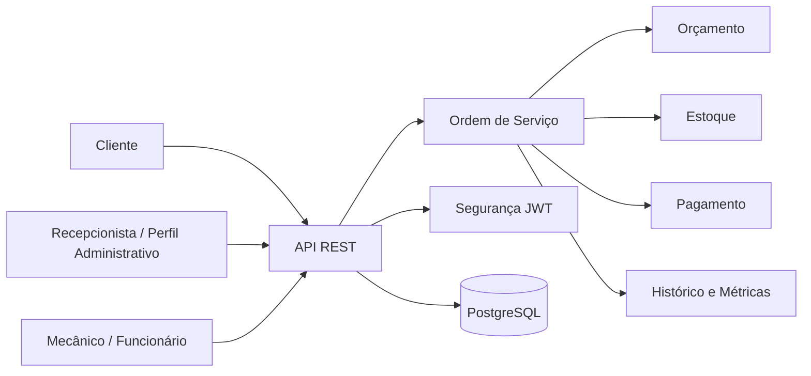

# AutoFlow


_Sistema para gerenciamento dos processos de oficinas mecânicas, centralizando o ciclo de vida das Ordens de Serviço (OS), desde a abertura até a entrega do veículo._

---

## 👥 Equipe e Materiais

### Participantes

| Participante | Discord |
| --- | --- |
| Thalita de Alencar | Thalita. (`thalita_`) |
| Bruna Zorzanello | Bruna Zorzanello (`brunazorzanello`) |
| Caroline Lampert | Carolsla (`carolsla`) |

### Materiais do Projeto

- **Documentação DDD:** [Board no Miro](https://miro.com/app/board/uXjVH7ifFEw=/?share_link_id=371619344967)
    - **Storytelling:** [Storytelling](./docs/assets/storytelling.jpg)
- **Pitch do MVP:** [AutoFlow - Demonstração do Projeto](https://www.youtube.com/watch?v=LDuQph48AqU)

---

## 🗄️ Seções do Documento

| Seção                                             | Subseções                                                                                |
| ------------------------------------------------- | ---------------------------------------------------------------------------------------- |
| [🎯 Visão Geral](#-visão-geral)                   | [Objetivo](#objetivo-do-sistema), [Stack](#stack-tecnológica), [Fluxo](#fluxo-principal),  [DDD](#domain-driven-design)|
| [🏗️ Arquitetura](#️-arquitetura)                   | [Estrutura](#estrutura-da-solução), [Diagrama](#diagrama-de-alto-nível), [HLD](#diagrama-de-alto-nível-high-level-designhld)                  |
| [💼 Regras de Negócio](#-regras-de-negócio)       | [Principais Regras Implementadas](#principais-regras-implementadas)                                            |
| [📚 Documentação Oficial](#-documentação-oficial) | [Negócio](#negócio), [Técnica](#técnica), [Arquitetura](#arquitetura-1)                  |
| [⚙️ Execução](#-execução)                         | [Comandos rápidos](#comandos-rápidos), [Docker](#docker), [SonarQube](#sonarqube)        |
| [✅ Observações](#-observações)                   | [Importantes](#observações-importantes), [Execução local](#execução-local)               |

---

## 🎯 Visão Geral

### Objetivo do Sistema

O AutoFlow foi desenvolvido para substituir processos manuais e descentralizados por um fluxo centralizado de atendimento e execução de serviços em oficinas mecânicas. 

Ele tem como propósito:

- **Centralizar** o ciclo de vida da Ordem de Serviço;
- **Controlar** o fluxo entre recebimento, diagnóstico, aprovação, execução e entrega;
- **Apoiar** a gestão de estoque, orçamento, pagamento e histórico operacional;
- **Fornecer** histórico e métricas para acompanhamento operacional.

### Stack Tecnológica

- Java 25
- Spring Boot 4.1.0
- Spring Web MVC
- Spring Data JPA
- Spring Security
- PostgreSQL
- JWT
- Springdoc OpenAPI / Swagger UI
- Lombok + MapStruct
- Maven
- Docker / Docker Compose
- SonarQube
- JaCoCo

### Fluxo Principal

```text
RECEBIDA
  ↓
EM_DIAGNOSTICO
  ↓
AGUARDANDO_APROVACAO
  ↓
ORCAMENTO_APROVADO
  ↓
EM_EXECUCAO
  ↓
FINALIZADA
  ↓
ENTREGUE
```

### Domain Driven Design
A descoberta e modelagem do domínio foram realizadas utilizando práticas de DDD, incluindo:

- **Brainstorming;**
- **Domain Storytelling;**
- **Eventos Pivotais;**
- **Linha do Tempo;**
- **Event Storming.**

Os diagramas e o detalhamento da descoberta do domínio estão concentrados na [Documentação de Negócio](./docs/BUSINESS.md).

<p>
  
</p>

---

## 🏗️ Arquitetura

### Estrutura da Solução

O sistema segue uma arquitetura monolítica modular em Spring Boot, organizada em camadas de domínio, aplicação, interface e infraestrutura. A documentação detalhada está em:

- [ARCHITECTURE.md](docs/ARCHITECTURE.md)
- [DAS.md](docs/DAS.md)
- [ADR.md](docs/ADR.md)

### Diagrama de Alto Nível (High Level Design/HLD)



---

## 💼 Regras de Negócio

### Principais Regras Implementadas

As regras abaixo refletem o comportamento identificado no código e na lógica de domínio do projeto. Entre as principais regras, estão:

- **Início por agendamento e limite de pátio:** A Ordem de Serviço (OS) exige agendamento prévio para ser iniciada e está sujeita ao limite de capacidade do pátio.
- **Ciclo de vida do orçamento:** O orçamento transita entre os status: Pendente, Aprovado, Recusado, Expirado e Cancelado.
- **Aprovação via app:** A aprovação do orçamento é realizada diretamente pelo cliente através do aplicativo.
- **Bloqueio de liberação:** A entrega do veículo permanece bloqueada enquanto houver pendência financeira/pagamento em aberto.
- **Precedência do orçamento complementar:** Um orçamento complementar exige a existência e validação prévia de um orçamento inicial.
- **Alerta de estoque crítico:** O sistema dispara alertas para estoque baixo focado exclusivamente em peças compartilhadas.
- **Histórico e métrica operacional:** O sistema consolida o histórico completo por veículo e registra as métricas de tempo de execução e finalização.

O detalhamento completo das regras de negócio está disponível em [BUSINESS.md](./docs/BUSINESS.md).

---

## 📚 Documentação Oficial

### Negócio

- [BUSINESS.md](docs/BUSINESS.md)

### Técnica

- [TECHNICAL.md](docs/TECHNICAL.md)

### Arquitetura

- [ARCHITECTURE.md](docs/ARCHITECTURE.md)
- [DAS.md](docs/DAS.md)
- [ADR.md](docs/ADR.md)

---

## ⚙️ Execução

### Pré-requisitos

- JDK 25;
- PostgreSQL configurado conforme as variáveis de ambiente da aplicação.
- Docker e Docker Compose, caso utilize a execução por containers;
- Sonar.

> ###### NOTA: O Maven Wrapper está disponível no projeto. A instalação global do Maven é necessária apenas caso você opte por utilizar o Maven diretamente no terminal ou na IDE.

### Terminal ou IDE

#### Linux/macOS
```
./mvnw clean package
./mvnw spring-boot:run
```

#### Windows
```
./mvnw clean package
./mvnw spring-boot:run
```

### Docker

```
docker compose up -d
```

```bash
# Para acompanhar os logs
docker compose logs -f autoflow-app
```

### SonarQube

```
docker compose up -d sonarqube
./mvnw clean verify
./mvnw sonar:sonar -Dsonar.host.url=http://localhost:9000
```

---

## ✅ Observações

### Observações Importantes

- O projeto usa autenticação stateless com JWT e autorização por perfil.
- A API é documentada utilizando Springdoc OpenAPI e disponibilizada através do Swagger UI;
- Há testes automatizados em `src/test/java` e cobertura via JaCoCo.
- O banco principal é PostgreSQL.
- O sistema possui regras agendadas para cancelamento e abandono técnico.
- A operação administrativa da oficina é realizada pela recepcionista, representada no sistema pelo perfil administrativo;
- O o sistema possui controle de estoque mínimo com geração de alertas para reposição.

---
