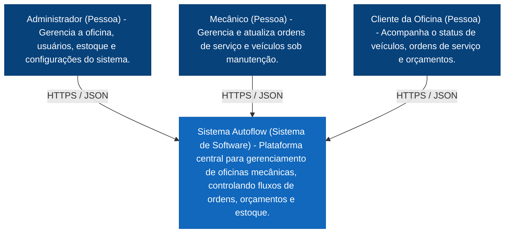
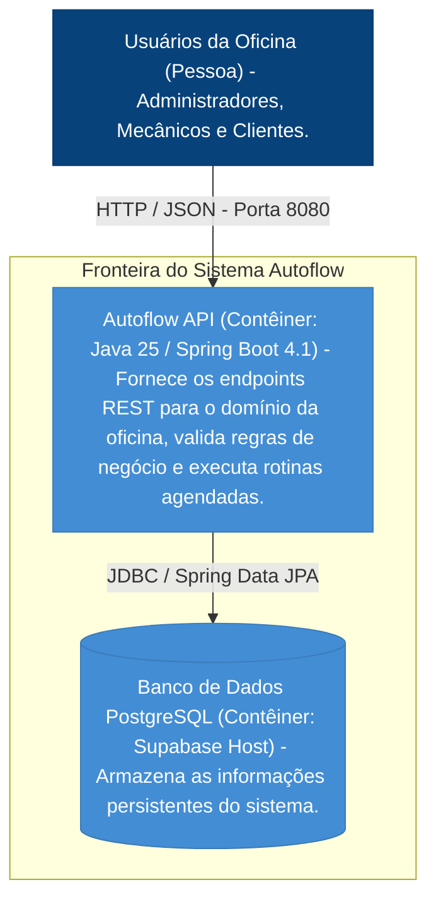
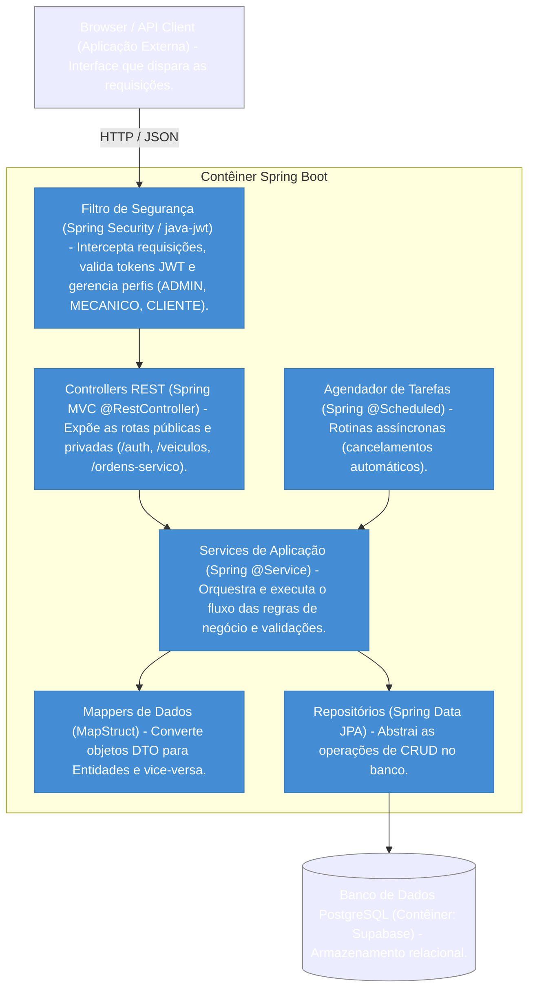

# Documentação Arquitetural do AutoFlow

_Arquitetura técnica do sistema AutoFlow, com base no modelo C4, nas camadas do Spring Boot e nos principais fluxos do domínio._

---

## 🗄️ Seções do Documento

| Seção                                             | Subseções                                                                                                                               |
| ------------------------------------------------- | --------------------------------------------------------------------------------------------------------------------------------------- |
| [🎯 Visão Geral](#-visão-geral)                   | [Objetivo](#objetivo), [Escopo](#escopo-da-arquitetura)                                                                                 |
| [🗺️ Nível C4](#-nível-c4)                         | [Contexto](#nível-1-contexto-do-sistema), [Contêineres](#nível-2-contêineres), [Componentes](#nível-3-componentes)                      |
| [🏗️ Estrutura do Código](#-estrutura-do-código)   | [Visão geral](#visão-geral-da-arquitetura), [Entidades](#entidades-do-domínio), [Serviços](#services), [Controllers](#controllers-rest) |
| [🔐 Segurança e Fluxos](#-segurança-e-fluxos)     | [JWT](#segurança-jwt-filtros-e-autorização), [Fluxos](#fluxo-principal-criação-e-aprovação-de-orçamento)                                |
| [📊 Conexões e Conclusão](#-conexões-e-conclusão) | [Relacionamentos](#conexões-entre-classes-principais), [Resumo](#conclusão)                                                             |

---

## 🎯 Visão Geral

### Objetivo

Este documento descreve a arquitetura de software do sistema **Autoflow** utilizando a metodologia do **Modelo C4** com gráficos renderizados via Mermaid.

### Escopo da arquitetura

A API está organizada em camadas bem definidas:

- Domain model: entidades JPA e enums do negócio;
- Domain repository: interfaces de persistência com JPA;
- Application service: regras de negócio e orquestração;
- Application dto: objetos de entrada e saída da API;
- Infrastructure mapper: conversão entre DTO e entidade;
- Interfaces controller: endpoints REST;
- Infrastructure security: autenticação e autorização via JWT;
- Exceptions: tratamento centralizado de erros.

A arquitetura segue um padrão MVC/clean-ish, com foco em Spring Boot + JPA + Spring Security.

---

## 🗺️ Nível C4

### Nível 1: Contexto do Sistema

O Autoflow é uma plataforma centralizada para o gerenciamento de oficinas mecânicas. Neste nível macro, o sistema é tratado como uma caixa preta única, detalhando apenas como os atores interagem com ele.

### Nível 2: Contêineres

Neste nível, dividimos o Sistema Autoflow nas suas aplicações executáveis e armazenamentos de dados reais encontrados no repositório do projeto.

### Nível 3: Componentes

Detalhamento interno do contêiner **Autoflow API**, demonstrando como as pastas e pacotes estruturais do Spring Boot se comunicam internamente.

---

## 🏗️ Estrutura do Código

### Visão geral da arquitetura

A API está organizada em camadas bem definidas:

- **Domain model:** entidades JPA e enums do negócio;
- **Domain repository:** interfaces de persistência com JPA;
- **Application service:** regras de negócio e orquestração;
- **Application DTO:** objetos de entrada e saída da API;
- **Infrastructure mapper:** conversão entre DTO e entidade;
- **Interfaces controller:** endpoints REST;
- **Infrastructure security:** autenticação e autorização via JWT;
- **Exceptions:** tratamento centralizado de erros.

### Entidades do domínio

#### Cliente

**Package:** `br.com.autoflow.domain.model`

**Atributos:**

- `UUID id`
- `String nome`
- `String documento`
- `String email`
- `LocalDate dataNascimento`
- `String telefone`
- `Genero genero`
- `Endereco endereco`

**Relacionamentos:**

- `@ManyToOne` com `Endereco`;
- `@OneToMany` com veículos e ordens de serviço, conforme o modelo JPA.

**Métodos principais:**

- não há lógica de negócio complexa no modelo; a entidade funciona como estrutura principal de cliente.

#### Endereco

**Atributos:**

- `UUID id`
- `String cep`
- `String uf`
- `String cidade`
- `String bairro`
- `String logradouro`
- `String numero`
- `String complemento`

**Observações:**

- estrutura essencial para cadastro de cliente e funcionário;
- pode ser usada por múltiplas entidades conforme a relação JPA.

#### Funcionario

**Atributos:**

- `UUID idFuncionario`
- `String cpf`
- `String nome`
- `String telefone`
- `String email`
- `Genero genero`
- `LocalDate dataNascimento`
- `Cargo cargo`
- `Endereco endereco`
- `boolean ocupado`
- `int nr_advertencias`

**Métodos principais:**

- `void ocupar()` → marca `ocupado = true`;
- `void liberar()` → marca `ocupado = false`;
- `void adicionarAdvertencia()` → incrementa `nr_advertencias`;
- `boolean deveSerDemitido()` → retorna `true` quando `nr_advertencias >= 3`.

**Responsabilidade:**

Representa o colaborador que executa serviços/diagnósticos e pode ser vinculado a uma conta de usuário.

#### Usuario

**Package:** `br.com.autoflow.domain.model`

**Atributos:**

- `UUID id`
- `String login`
- `String senha`
- `Perfil perfil`
- `Cliente cliente`
- `Funcionario funcionario`

**Implementa:** `UserDetails`

**Métodos principais:**

- `Collection<? extends GrantedAuthority> getAuthorities()`
- `String getUsername()`
- `String getPassword()`
- `boolean isAccountNonExpired()`
- `boolean isAccountNonLocked()`
- `boolean isCredentialsNonExpired()`
- `boolean isEnabled()`

**Responsabilidade:**

Entidade de autenticação e autorização do sistema.

#### Veiculo

**Atributos:**

- `UUID idVeiculo`
- `String placa`
- `String modelo`
- `String marca`
- `BigDecimal kmAtual`
- `Integer anoFabricacao`
- `String cor`
- `Cliente cliente`

**Responsabilidade:**

Representa o automóvel relacionado a um cliente e a uma OS.

#### Servico

**Atributos:**

- `UUID idServico`
- `String dsServico`
- `BigDecimal vlServico`
- `Integer qtTempoEstimadoMin`

**Responsabilidade:**

Define o catálogo de serviços disponíveis para orçamento e OS.

#### Estoque

**Atributos:**

- `UUID id`
- `String nomeItem`
- `String nomeMarca`
- `BigDecimal valorUnitario`
- `Integer quantidadeEstoque`
- `Integer quantidadeMinima`
- `TipoItemEstoque tipoCategoria`

**Métodos principais:**

- `boolean deveDispararAlertaEstoqueBaixo()`
- `boolean deveGerarAlertaEstoqueBaixo()`

**Responsabilidade:**

Regra central de estoque mínimo e alerta de baixo estoque.

#### Orcamento

**Atributos:**

- `UUID id`
- `TipoOrcamento tipoOrcamento`
- `StatusOrcamento status`
- `LocalDateTime dataCriacao`
- `LocalDateTime dataExpiracao`
- `LocalDateTime dataDecisao`
- `BigDecimal subtotalPecas`
- `BigDecimal maoObra`
- `BigDecimal total`
- `OrdemServico ordemServico`
- `List<OrcamentoServico> servicos`
- `List<OrcamentoItem> itens`

**Métodos principais:**

- `void aprovar()`
- `void recusar()`
- `void expirar()`
- `void aplicarNovoStatus(StatusOrcamento novoStatus)`
- `void atualizarStatusReservaItens(StatusReservaEstoque status)`
- `void validarMudancaStatus()`
- `void recalcularTotais()`

**Observações:**

- a entidade representa o orçamento e está conectada com a ordem de serviço;
- ela também manipula itens e serviços do orçamento.

#### OrcamentoServico

**Atributos:**

- `UUID id`
- `BigDecimal maoDeObra`
- `Servico servico`
- `List<OrcamentoItem> itens`
- `Orcamento orcamento`

**Responsabilidade:**

Representa um serviço incluído no orçamento.

#### OrcamentoItem

**Atributos:**

- `UUID id`
- `StatusReservaEstoque statusReserva`
- `Integer quantidade`
- `BigDecimal valorUnitario`
- `BigDecimal valorTotal`
- `UUID idEstoque`
- `OrcamentoServico orcamentoServico`
- `Orcamento orcamento`

**Observações:**

- o campo `idEstoque` é um UUID, não uma relação JPA direta com a entidade `Estoque`;
- isso exige busca manual no repositório do estoque.

#### OrdemServico

**Atributos principais:**

- `UUID idOs`
- `StatusOS statusOS`
- `String dsRelatoCliente`
- `String dsDiagnostico`
- `boolean stTermoAceito`
- `LocalDateTime dtAceiteTermo`
- `BigDecimal nrKmEntrada`
- `LocalDateTime dtAberturaOs`
- `LocalDateTime dtInicioDiagnostico`
- `LocalDateTime dtFimDiagnostico`
- `LocalDateTime dtAprovacaoOrcamento`
- `LocalDateTime dataInicioExecucao`
- `LocalDateTime dataFimExecucao`
- `LocalDateTime dtEncerramentoOs`
- `LocalDateTime dtReagendamentoOs`
- `StatusPagamento stPagamento`
- `String dsMotivoCancelamento`
- `BigDecimal taxaPermanencia`
- `UUID idCliente`
- `UUID idVeiculo`
- `UUID idFuncionario`
- `List<Orcamento> idsOrcamento`
- `List<OsServico> servicosExecucao`

**Métodos principais:**

- `void prePersist()`
- `void carregarServicosDosOrcamentosAprovados()`
- `void atualizarStatus(StatusOS novoStatus, String observacao)`
- `Long getTempoTotalExecucaoMinutos()`
- `Long getTempoTotalEstimadoMinutos()`
- `Long getDiferencaMinutos()`
- `void aprovarOrcamentosVinculados(LocalDateTime dataAprovacao)`
- `void recusarOrcamentosVinculados()`
- `void verificarCancelamentoAutomatico(int diasLimite, BigDecimal valorDiaria)`
- `void verificarAbandonoTecnico(int diasLimiteAbandono)`

**Responsabilidade:**

É o centro do processo operacional: recebe o cliente, vincula veículo, envolve orçamentos e serviços e controla o ciclo da ordem de serviço.

#### OsServico

**Atributos:**

- `UUID id`
- `OrdemServico ordemServico`
- `Servico servico`
- `LocalDateTime dataInicioExecucao`
- `LocalDateTime dataFimExecucao`

**Responsabilidade:**

Representa a execução de um serviço dentro de uma ordem de serviço.

### Enums do sistema

Os enums principais estão em `br.com.autoflow.domain.enums`.

**Principais enums:**

- `StatusOS`
- `StatusOrcamento`
- `StatusReservaEstoque`
- `TipoItemEstoque`
- `Perfil`
- `Cargo`
- `Genero`
- `TipoOrcamento`
- `StatusPagamento`

Esses enums controlam regras de negócio e permissões do sistema.

### Repositórios

Todos os repositórios estendem `JpaRepository<T, UUID>`.

#### EstoqueRepository

**Métodos:**

- `List<Estoque> findByNomeItemContainingIgnoreCase(String nome)`

**Responsabilidade:**

Acesso ao estoque por nome.

#### OrcamentoRepository

**Métodos:**

- `boolean existsByIdAndOrdemServicoIsNotNull(UUID idOrcamento)`
- `List<Orcamento> findByOrdemServicoIdOs(UUID idOs)`
- `void deletarItensDiretosPorOrcamento(UUID id)`
- `void deletarItensPorServicosDoOrcamento(UUID id)`
- `void deletarServicosPorOrcamento(UUID id)`

**Responsabilidade:**

Persistência e limpeza de itens/serviços do orçamento.

#### OrdemServicoRepository

**Responsabilidade:**

Consultas relacionadas a métricas, histórico por veículo e filtros por status.

### DTOs

Os DTOs ficam em `br.com.autoflow.application.dto`.

#### DTOs da API de estoque

- `EstoqueRequest`
- `EstoqueResponse`
- `AdicionarEstoqueRequest`
- `AtualizarValorEstoqueRequest`

#### DTOs de orçamento

- `OrcamentoRequest`
- `OrcamentoResponse`
- `OrcamentoItemRequest`
- `OrcamentoItemResponse`
- `OrcamentoServicoRequest`
- `OrcamentoServicoResponse`
- `AtualizarStatusOrcamentoRequest`

#### DTOs de ordem de serviço

- `OrdemServicoRequest`
- `OrdemServicoResponse`
- `AtualizarStatusOSRequest`
- `AtualizarStatusPagamentoRequest`
- `MetricaOsResponse`
- `HistoricoVeiculoResponse`

#### DTOs de autenticação

- `LoginRequest`
- `TokenResponse`

#### DTOs de serviço e veículo

- `ServicoRequest`
- `ServicoResponse`
- `VeiculoRequest`
- `VeiculoResponse`
- `FuncionarioRequest`
- `FuncionarioResponse`

### Mappers

Os mappers ficam em `br.com.autoflow.infrastructure.mapper` e em sua maioria usam MapStruct.

**Mappers importantes:**

- `EstoqueMapper`
- `OrcamentoMapper`
- `OrcamentoItemMapper`
- `OrcamentoServicoMapper`
- `OrdemServicoMapper`
- `ServicoMapper`
- `VeiculoMapper`
- `FuncionarioMapper`
- `ClienteMapper`
- `EnderecoMapper`
- `OsServicoMapper`

**Função:**

- converter entre entidade e DTO;
- implementar atualização parcial de objetos.

### Services

#### EstoqueService

**Dependências:**

- `EstoqueRepository estoqueRepository`
- `EstoqueMapper estoqueMapper`

**Métodos principais:**

- `EstoqueResponse criar(EstoqueRequest request)`
- `List<EstoqueResponse> listarTodos()`
- `EstoqueResponse buscarPorId(UUID id)`
- `EstoqueResponse adicionarQuantidade(UUID id, AdicionarEstoqueRequest request)`
- `EstoqueResponse atualizarValorUnitario(UUID id, AtualizarValorEstoqueRequest request)`
- `EstoqueResponse atualizar(UUID id, EstoqueRequest request)`
- `List<EstoqueResponse> listarInsumosComEstoqueBaixo()`
- `void reservarEstoqueParaItens(List<OrcamentoItemRequest> itens)`
- `void devolverEstoqueDeItens(List<OrcamentoItemRequest> itens)`

**Responsabilidade:**

Gestão do estoque: cadastro, ajuste, reserva e conferência de itens em nível crítico.

#### OrcamentoService

**Dependências:**

- `OrcamentoRepository orcamentoRepository`
- `OrcamentoMapper orcamentoMapper`
- `OrdemServicoRepository ordemServicoRepository`
- `EstoqueRepository estoqueRepository`
- `OrcamentoExpiradoService orcamentoExpiradoService`

**Métodos principais:**

- `OrcamentoResponse criar(OrcamentoRequest request)`
- `List<OrcamentoResponse> listarTodos()`
- `OrcamentoResponse buscarPorId(UUID id)`
- `List<OrcamentoResponse> listarPorOrdemServico(UUID idOs)`
- `void delete(UUID id)`
- `OrcamentoResponse atualizarStatus(UUID id, AtualizarStatusOrcamentoRequest request)`
- `void deduzirItensDoEstoque(Orcamento orcamento)`
- `List<String> verificarAvisosEstoque(Orcamento orcamento)`
- `OrcamentoResponse mapToResponseComAvisos(Orcamento orcamento)`

**Fluxo de negócio:**

1. a API recebe um orçamento;
2. o sistema monta a entidade com itens e serviços;
3. o status inicial é `PENDENTE`;
4. quando o orçamento é aprovado, o sistema valida o estoque e faz a dedução das quantidades;
5. caso o estoque fique baixo, o sistema gera avisos na resposta do orçamento.

#### OrdemServicoService

**Dependências:**

- `OrdemServicoRepository ordemServicoRepository`
- `OrdemServicoMapper ordemServicoMapper`
- `FuncionarioRepository funcionarioRepository`
- `OrcamentoService orcamentoService`

**Métodos principais:**

- `List<OrdemServicoResponse> listarTodas()`
- `OrdemServicoResponse buscarPorId(UUID id)`
- `OrdemServicoResponse criar(OrdemServicoRequest request, boolean agendamento)`
- `OrdemServicoResponse atualizar(UUID id, OrdemServicoRequest request)`
- `void atualizarStatusPagamento(UUID id, StatusPagamento pagamento)`
- `void deletar(UUID id)`
- `OrdemServicoResponse atualizarStatus(UUID id, AtualizarStatusOSRequest request)`
- `MetricaOsResponse obterMetricasPorOS(UUID idOs)`
- `Page<MetricaOsResponse> buscarMetricasComFiltro(...)`
- `List<HistoricoVeiculoResponse> obterHistoricoPorVeiculo(UUID idVeiculo)`
- `void processarCancelamentosAutomaticos()`

**Responsabilidade:**

Gerencia o ciclo de vida da ordem de serviço e a integração com orçamento, pagamento e operação técnica.

#### ServicoService

- `ServicoResponse criar(ServicoRequest request)`
- `Page<ServicoResponse> listarTodos(Pageable pageable)`
- `ServicoResponse buscarPorId(UUID id)`
- `ServicoResponse atualizar(UUID id, ServicoRequest request)`
- `void deletar(UUID id)`

#### VeiculoService

- `VeiculoResponse criar(VeiculoRequest request)`
- `List<VeiculoResponse> listar()`
- `VeiculoResponse buscarPorId(UUID id)`
- `VeiculoResponse atualizar(UUID id, VeiculoRequest request)`
- `void deletar(UUID id)`

#### FuncionarioService

- `FuncionarioResponse criar(FuncionarioRequest request)`
- `List<FuncionarioResponse> listar()`
- `FuncionarioResponse buscar(UUID id)`
- `FuncionarioResponse atualizar(UUID id, FuncionarioRequest request)`
- `void deletar(UUID id)`
- `String registrarAdvertencia(UUID id)`

### Controllers REST

#### AutoController / autenticação

**Endpoint:** `POST /auth/login`

**Responsabilidade:**

Autentica usuário e retorna token JWT.

#### EstoqueController

**Base path:** `/estoque`

**Endpoints:**

- `POST /estoque`
- `GET /estoque`
- `GET /estoque/{id}`
- `PATCH /estoque/{id}/adicionar-quantidade`
- `PATCH /estoque/{id}/valor-unitario`
- `PUT /estoque/{id}`

#### OrcamentoController

**Base path:** `/orcamentos`

**Endpoints:**

- `POST /orcamentos`
- `GET /orcamentos`
- `GET /orcamentos/{id}`
- `DELETE /orcamentos/{id}`
- `PATCH /orcamentos/{id}/status`
- `GET /orcamentos/ordem-servico/{idOs}`

#### OrdemServicoController

**Base path:** `/ordens-servico`

**Endpoints:**

- `GET /ordens-servico`
- `GET /ordens-servico/{id}`
- `POST /ordens-servico?agendamento=false`
- `PUT /ordens-servico/{id}`
- `PATCH /ordens-servico/{id}/status`
- `PATCH /ordens-servico/{id}/pagamento`
- `GET /ordens-servico/{idOs}/metricas`
- `GET /ordens-servico/metricas`
- `GET /ordens-servico/veiculo/{idVeiculo}/historico`
- `DELETE /ordens-servico/{id}`
- `POST /ordens-servico/processar-cancelamentos`

#### ServicoController

**Base path:** `/servicos`

**Endpoints:**

- `POST /servicos`
- `GET /servicos`
- `GET /servicos/{id}`
- `PUT /servicos/{id}`
- `DELETE /servicos/{id}`

#### VeiculoController

**Base path:** `/veiculos`

**Endpoints:**

- `POST /veiculos`
- `GET /veiculos`
- `GET /veiculos/{id}`
- `PUT /veiculos/{id}`
- `DELETE /veiculos/{id}`

#### FuncionarioController

**Base path:** `/funcionarios`

**Endpoints:**

- `POST /funcionarios`
- `GET /funcionarios`
- `GET /funcionarios/{id}`
- `PUT /funcionarios/{id}`
- `DELETE /funcionarios/{id}`
- `PATCH /funcionarios/{id}/advertencia`

---

## 🔐 Segurança e Fluxos

### Segurança: JWT, filtros e autorização

#### TokenService

**Atributos:**

- `String secret`
- `Long expirationMinutes`

**Métodos principais:**

- `String gerarToken(Usuario usuario)`
- `String validarToken(String token)`

**Responsabilidade:**

Gerar e validar credenciais JWT para autenticação da API.

#### SecurityFilter

**Métodos principais:**

- `String recuperarToken(HttpServletRequest request)`
- `doFilterInternal(HttpServletRequest request, HttpServletResponse response, FilterChain chain)`

**Responsabilidade:**

Aplicar autenticação em todas as requisições que chegam na API.

#### SecurityConfigurations

**Responsabilidade:**

Define as regras de autorização e endpoints públicos.

**Exemplo de regra:**

- `POST /auth/login` → público;
- `DELETE /**` → somente `ADMIN`;
- endpoints de operação e consulta → regras por perfil;
- restante → autenticado.

### Fluxo principal: criação e aprovação de orçamento

#### Fluxo de criação

1. `POST /orcamentos` chama `OrcamentoController.criar(request)`;
2. `OrcamentoService.criar(request)` recebe a demanda;
3. o service monta a entidade `Orcamento`;
4. os itens e serviços são ligados ao orçamento;
5. o status inicial fica `PENDENTE`;
6. o sistema retorna `OrcamentoResponse`.

#### Fluxo de aprovação

1. `PATCH /orcamentos/{id}/status` chama `OrcamentoController.atualizarStatus()`;
2. `OrcamentoService.atualizarStatus(id, request)` busca o orçamento;
3. valida a transição de status;
4. se o status for `APROVADO`, chama `deduzirItensDoEstoque(orcamento)`;
5. o service percorre os itens do orçamento e reduz a quantidade em `Estoque`;
6. se a quantidade ficar no limite mínimo ou abaixo, gera avisos de estoque;
7. o orçamento recebe status aprovado e é salvo.

#### Fluxo de reserva

- na criação do orçamento, o item pode entrar como `RESERVADO`;
- durante a aprovação, o item pode ser convertido para `VENDIDO` após a dedução do estoque;
- se houver reversão, `EstoqueService.devolverEstoqueDeItens(...)` pode reverter o movimento.

### Fluxo principal: ordem de serviço

1. `POST /ordens-servico` cria uma OS com cliente, veículo e dados iniciais;
2. a OS pode receber orçamentos vinculados;
3. a aprovação do orçamento influencia o estado da OS;
4. `OrdemServicoService.atualizarStatus()` valida a transição de etapas;
5. quando a OS avança para execução, o sistema aloca os serviços e controla tempos;
6. em conclusão, pode ocorrer atualização de pagamento ou encerramento.

---

## 📊 Conexões e Conclusão

### Conexões entre classes principais

**Relacionamentos principais:**

- `Cliente` -> `Endereco`;
- `Usuario` -> `Cliente`;
- `Usuario` -> `Funcionario`;
- `Funcionario` -> `Endereco`;
- `Veiculo` -> `Cliente`;
- `OrdemServico` -> `Cliente` (via `idCliente`) e `Veiculo` (via `idVeiculo`);
- `OrdemServico` -> `Orcamento` (OneToMany);
- `Orcamento` -> `OrcamentoServico` (OneToMany);
- `OrcamentoServico` -> `Servico`;
- `OrcamentoServico` -> `OrcamentoItem` (OneToMany);
- `OrcamentoItem` -> `UUID idEstoque`;
- `Controller` -> `Service`;
- `Service` -> `Repository`;
- `Service` -> `Mapper`;
- `SecurityFilter` -> `TokenService`;
- `TokenService` -> `UsuarioRepository`.

### Conclusão

O código atual da API apresenta uma estrutura bem organizada em camadas, com foco em:

- gestão de clientes, veículos, funcionários e serviços;
- controle de orçamentos e ordens de serviço;
- estoque e regras de baixo estoque;
- autenticação e autorização via JWT;
- gestão de status e transições do processo operacional.

**As classes centrais são:**

- `OrdemServico`
- `Orcamento`
- `Estoque`
- `Funcionario`
- `Usuario`
- `TokenService`
- `OrcamentoService`
- `OrdemServicoService`
- `EstoqueService`

Essas classes formam o núcleo funcional do sistema e são os pontos principais para explicar a lógica de negócio no trabalho de documentação.

---
