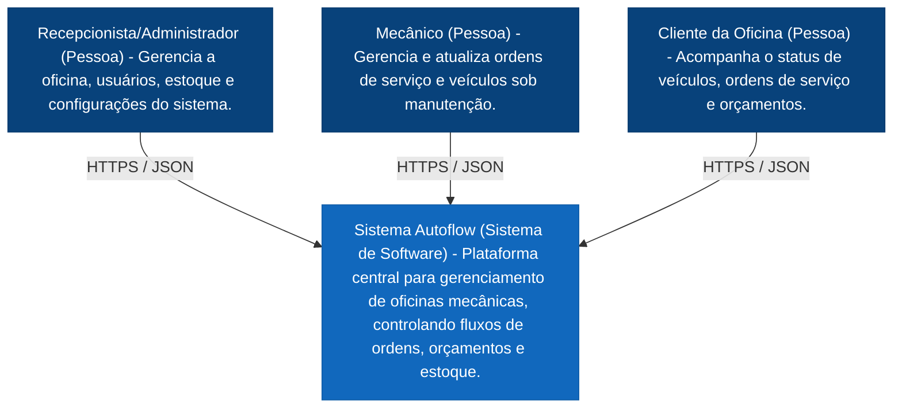
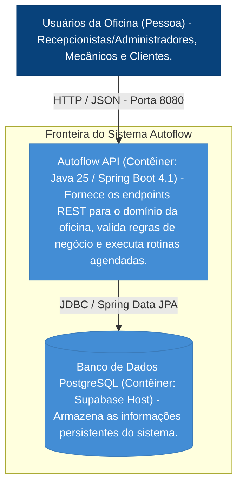
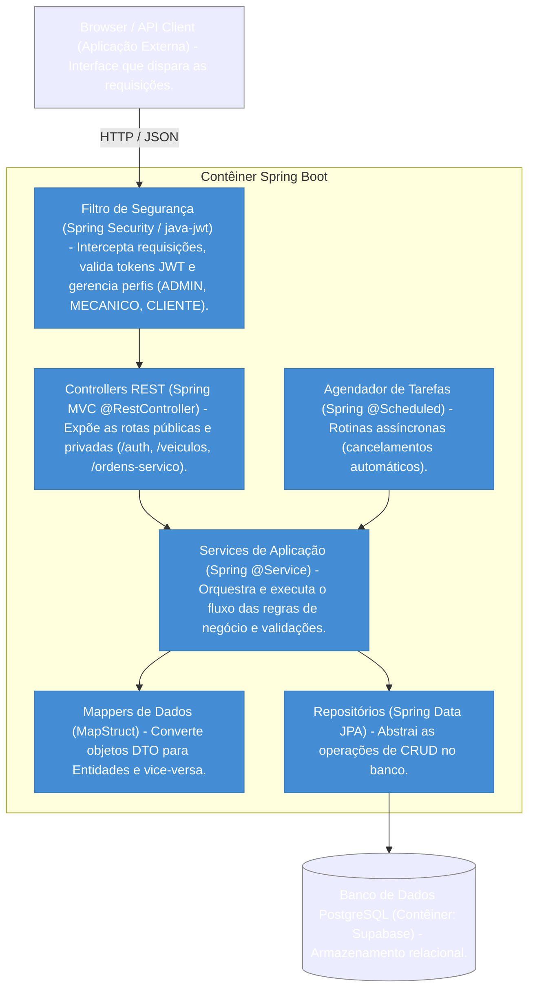
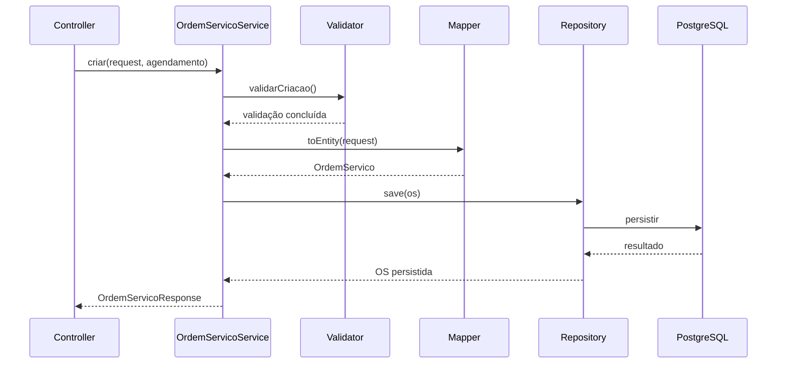
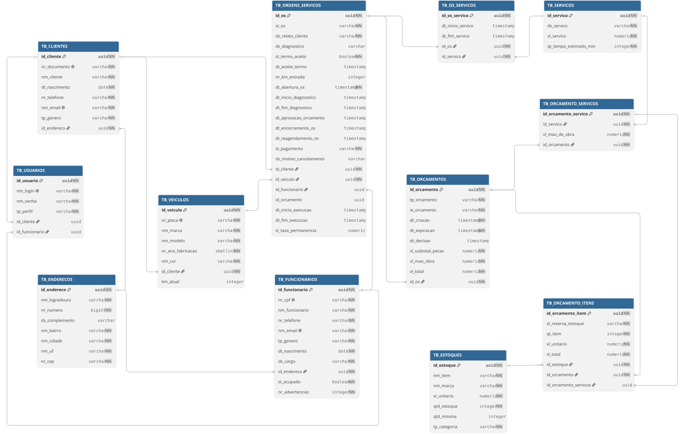

# Documentação Arquitetural - AutoFlow


Arquitetura técnica do sistema AutoFlow, incluindo visão de alto e baixo nível, estrutura da aplicação, persistência, segurança, testes e infraestrutura.

---
## 🗄️ Seções do Documento

| Seção | Subseções |
| --- | --- |
| [🎯 Visão Geral](#-visão-geral) | [Objetivo](#objetivo), [Stack Tecnológica](#stack-tecnológica) |
| [🗺️ High Level Design - HLD](#️-high-level-design---hld) | [Visão de Alto Nível](#visão-de-alto-nível), [Blocos da Arquitetura](#blocos-da-arquitetura), [Modelo C4](#️-modelo-c4) |
| [🗺️ Modelo C4](#️-modelo-c4) | [Nível 1: Contexto do Sistema](#nível-1-contexto-do-sistema), [Nível 2: Contêineres](#nível-2-contêineres), [Nível 3: Componentes](#nível-3-componentes) |
| [🏗️ Arquitetura da Aplicação](#️-arquitetura-da-aplicação) | [Organização Arquitetural](#organização-arquitetural), [Arquitetura em Camadas](#arquitetura-em-camadas), [Organização do Código](#organização-do-código) |
| [🔎 Low Level Design - LLD](#-low-level-design---lld) | [Componentes da Aplicação](#componentes-da-aplicação), [Controllers REST](#controllers-rest), [Fluxos Técnicos](#fluxos-técnicos) |
| [🗃️ Banco de Dados](#️-banco-de-dados) | [Escolha do PostgreSQL](#escolha-do-postgresql), [Persistência](#persistência), [Modelo Entidade-Relacionamento](#modelo-entidade-relacionamento), [Consistência e Transações](#consistência-e-transações) |
| [🔐 Segurança](#-segurança) | [Autenticação](#autenticação), [Autorização](#autorização), [Validações](#validações), [Tratamento de Erros](#tratamento-de-erros) |
| [🧪 Testes e Qualidade](#-testes-e-qualidade) | [Estratégia de Testes](#estratégia-de-testes), [Cobertura de Testes](#cobertura-de-testes), [JaCoCo](#jacoco), [SonarQube](#sonarqube) |
| [🐳 Infraestrutura e Operação](#-infraestrutura-e-operação) | [Docker](#docker), [Docker Compose](#docker-compose), [Configuração por Ambiente](#configuração-por-ambiente) |
| [⚠️ Pontos de Evolução](#️-pontos-de-evolução) | [Evoluções Arquiteturais](#evoluções-arquiteturais) |
| [📚 Referências](#-referências) | [ADR](#adr), [DAS](#das) |
---

## 🎯 Visão Geral

### Objetivo

Este documento descreve a arquitetura do **Autoflow**, consolidando a documentação técnica do sistema.

A documentação apresenta a solução em diferentes níveis de abstração, desde a interação dos atores com o sistema até os componentes internos responsáveis pela execução das principais operações.

### Stack Tecnológica

| Categoria           | Tecnologia                     |
| ------------------- | ------------------------------ |
| Linguagem           | Java 25                        |
| Framework principal | Spring Boot 4.1.0              |
| Web                 | Spring Web MVC                 |
| Persistência        | Spring Data JPA                |
| Banco de dados      | PostgreSQL                     |
| Segurança           | Spring Security + JWT          |
| Documentação da API | Springdoc OpenAPI / Swagger UI |
| Mapeamento          | MapStruct                      |
| Boilerplate         | Lombok                         |
| Build               | Maven                          |
| Conteinerização     | Docker / Docker Compose        |
| Qualidade           | SonarQube + JaCoCo             |
| Testes              | JUnit / Spring Boot Test       |

---

## 🗺️ High Level Design - HLD

### Visão de Alto Nível

O AutoFlow é uma aplicação Java com Spring Boot que centraliza os processos operacionais de uma oficina mecânica.

A Ordem de Serviço representa o principal elemento do fluxo operacional e conecta funcionalidades relacionadas a cliente, veículo, mecânico, orçamento, estoque, pagamento, histórico e métricas.

A solução é mantida em uma única aplicação executável, com separação de responsabilidades por camadas e módulos internos.

### Blocos da Arquitetura

**Interface:** Responsável pela exposição das funcionalidades da aplicação.

- **Componentes:**
    * Controllers REST;
    * Endpoints de autenticação;
    * Endpoints operacionais;
    * Contratos de entrada e saída da API;
    * Documentação OpenAPI disponibilizada pelo Swagger UI.

**Aplicação:** Responsável pela coordenação dos casos de uso e fluxos da aplicação.

- **Responsabilidades:**
    * Serviços de aplicação;
    * Orquestração das operações;
    * Validação de pré-condições;
    * Transições da Ordem de Serviço;
    * Processamento de orçamento;
    * Processamento de estoque;
    * Métricas e histórico.

**Domínio:** Concentra os elementos que representam o negócio e parte das regras associadas às entidades.

- **Componentes:**
    * Entidades;
    * Enums;
    * Estados e transições;
    * Regras do ciclo de vida da OS;
    * Regras de orçamento;
    * Regras de estoque.

**Infraestrutura:** Agrupa mecanismos técnicos necessários para suportar as demais camadas.

- **Componentes:**
    * Spring Data JPA;
    * PostgreSQL;
    * MapStruct;
    * Spring Security;
    * JWT;
    * Filtros de autenticação;
    * Processos agendados.

---

## 🗺️ Modelo C4

O Modelo C4 é utilizado para representar a arquitetura em diferentes níveis de abstração.

### Nível 1: Contexto do Sistema

Neste nível, o AutoFlow é tratado como uma única unidade de software e são representados apenas os atores que interagem diretamente com ele.



### Nível 2: Contêineres

Neste nível, o AutoFlow é decomposto em seus principais contêineres executáveis e de persistência, evidenciando como os usuários interagem com a API e como a aplicação se comunica com o banco de dados.



### Nível 3: Componentes

Detalhamento interno do contêiner **Autoflow API**, demonstrando como as pastas e pacotes estruturais do Spring Boot se comunicam internamente.



---

## 🏗️ Arquitetura da Aplicação

### Organização Arquitetural

A aplicação está organizada em responsabilidades técnicas bem definidas:

- **Domain model:** Entidades JPA e enums do negócio;
- **Domain repository:** Interfaces de persistência com JPA;
- **Application service:** Regras de negócio e orquestração;
- **Application DTO:** Objetos de entrada e saída da API;
- **Infrastructure mapper:** Conversão entre DTO e entidade;
- **Interfaces controller:** Endpoints REST;
- **Infrastructure security:** Autenticação e autorização via JWT;
- **Exceptions:** Tratamento centralizado de erros.

### Arquitetura em Camadas

A aplicação distribui suas responsabilidades entre as seguintes áreas:

```text
Interfaces
    ↓
Application
    ↓
Domain
    ↓
Infrastructure / Persistence
```

| Camada           | Responsabilidade                                                      |
| ---------------- | --------------------------------------------------------------------- |
| `interfaces`     | Exposição dos endpoints REST e comunicação com os consumidores da API |
| `application`    | Orquestração dos casos de uso, services e DTOs                        |
| `domain`         | Entidades, enums, repositories e regras associadas ao domínio         |
| `infrastructure` | Segurança, mapeamento e componentes técnicos                          |
| `exception`      | Tratamento centralizado de erros da aplicação                         |

###### NOTA: A classificação descreve a organização observada no projeto e suas responsabilidades, sem assumir aderência integral a um padrão arquitetural específico.

### Organização do Código

```text
src/
├── main/
│   └── java/br/com/autoflow/
│       ├── application/
│       │   ├── dto/
│       │   └── service/
│       ├── domain/
│       │   ├── enums/
│       │   ├── model/
│       │   └── repository/
│       ├── exception/
│       ├── infrastructure/
│       │   ├── mapper/
│       │   └── security/
│       └── interfaces/
│           └── controller/
└── test/
    └── java/
```

---

## 🔎 Low Level Design - LLD

O Low Level Design detalha a implementação interna da aplicação, seus componentes e as interações entre as camadas.

O inventário técnico de entidades, enums, repositories, DTOs, mappers, services e componentes internos de segurança está disponível de forma expansível para preservar o detalhamento da implementação sem comprometer a leitura principal do documento.

Os controllers, endpoints e fluxos técnicos permanecem visíveis por representarem os principais contratos e caminhos de execução da aplicação.

### Componentes da Aplicação

<details>
<summary><strong>Ver detalhamento técnico das classes e componentes</strong></summary>

<br>

### Entidades do Domínio

#### Cliente

**Package:** `br.com.autoflow.domain.model`

**Atributos:**

- `UUID id`
- `String nome`
- `String documento`
- `String email`
- `LocalDate dataNascimento`
- `String telefone`
- `Genero genero`
- `Endereco endereco`

**Relacionamentos:**

- `@ManyToOne` com `Endereco`;
- `@OneToMany` com veículos e ordens de serviço, conforme o modelo JPA.

**Métodos principais:**

- não há lógica de negócio complexa no modelo; a entidade funciona como estrutura principal de cliente.

#### Endereco

**Atributos:**

- `UUID id`
- `String cep`
- `String uf`
- `String cidade`
- `String bairro`
- `String logradouro`
- `String numero`
- `String complemento`

**Observações:**

- estrutura utilizada nos cadastros de cliente e funcionário;
- pode ser relacionada a múltiplas entidades conforme o modelo JPA.

#### Funcionario

**Atributos:**

- `UUID idFuncionario`
- `String cpf`
- `String nome`
- `String telefone`
- `String email`
- `Genero genero`
- `LocalDate dataNascimento`
- `Cargo cargo`
- `Endereco endereco`
- `boolean ocupado`
- `int nr_advertencias`

**Métodos principais:**

- `void ocupar()` → marca `ocupado = true`;
- `void liberar()` → marca `ocupado = false`;
- `void adicionarAdvertencia()` → incrementa `nr_advertencias`;
- `boolean deveSerDemitido()` → retorna `true` quando `nr_advertencias >= 3`.

**Responsabilidade:**

Representa o colaborador responsável por serviços e diagnósticos e que pode ser associado a uma conta de usuário.

#### Usuario

**Package:** `br.com.autoflow.domain.model`

**Atributos:**

- `UUID id`
- `String login`
- `String senha`
- `Perfil perfil`
- `Cliente cliente`
- `Funcionario funcionario`

**Implementa:** `UserDetails`

**Métodos principais:**

- `Collection<? extends GrantedAuthority> getAuthorities()`
- `String getUsername()`
- `String getPassword()`
- `boolean isAccountNonExpired()`
- `boolean isAccountNonLocked()`
- `boolean isCredentialsNonExpired()`
- `boolean isEnabled()`

**Responsabilidade:**

Entidade utilizada no processo de autenticação e autorização do sistema.

#### Veiculo

**Atributos:**

- `UUID idVeiculo`
- `String placa`
- `String modelo`
- `String marca`
- `BigDecimal kmAtual`
- `Integer anoFabricacao`
- `String cor`
- `Cliente cliente`

**Responsabilidade:**

Representa o veículo associado ao cliente e aos atendimentos realizados pela oficina.

#### Servico

**Atributos:**

- `UUID idServico`
- `String dsServico`
- `BigDecimal vlServico`
- `Integer qtTempoEstimadoMin`

**Responsabilidade:**

Representa o catálogo de serviços disponíveis para composição dos orçamentos e execução da OS.

#### Estoque

**Atributos:**

- `UUID id`
- `String nomeItem`
- `String nomeMarca`
- `BigDecimal valorUnitario`
- `Integer quantidadeEstoque`
- `Integer quantidadeMinima`
- `TipoItemEstoque tipoCategoria`

**Métodos principais:**

- `boolean deveDispararAlertaEstoqueBaixo()`
- `boolean deveGerarAlertaEstoqueBaixo()`

**Responsabilidade:**

Controla os itens de estoque e as regras relacionadas ao nível mínimo de peças e insumos.

#### Orcamento

**Atributos:**

- `UUID id`
- `TipoOrcamento tipoOrcamento`
- `StatusOrcamento status`
- `LocalDateTime dataCriacao`
- `LocalDateTime dataExpiracao`
- `LocalDateTime dataDecisao`
- `BigDecimal subtotalPecas`
- `BigDecimal maoObra`
- `BigDecimal total`
- `OrdemServico ordemServico`
- `List<OrcamentoServico> servicos`
- `List<OrcamentoItem> itens`

**Métodos principais:**

- `void aprovar()`
- `void recusar()`
- `void expirar()`
- `void aplicarNovoStatus(StatusOrcamento novoStatus)`
- `void atualizarStatusReservaItens(StatusReservaEstoque status)`
- `void validarMudancaStatus()`
- `void recalcularTotais()`

**Responsabilidade:**

Representa a proposta técnica e financeira relacionada à Ordem de Serviço e mantém seus itens, serviços, valores e estado.

#### OrcamentoServico

**Atributos:**

- `UUID id`
- `BigDecimal maoDeObra`
- `Servico servico`
- `List<OrcamentoItem> itens`
- `Orcamento orcamento`

**Responsabilidade:**

Representa um serviço incluído em determinado orçamento.

#### OrcamentoItem

**Atributos:**

- `UUID id`
- `StatusReservaEstoque statusReserva`
- `Integer quantidade`
- `BigDecimal valorUnitario`
- `BigDecimal valorTotal`
- `UUID idEstoque`
- `OrcamentoServico orcamentoServico`
- `Orcamento orcamento`

**Observações:**

- `idEstoque` é armazenado como UUID;
- quando necessário, o item correspondente é recuperado através do repository de estoque.

#### OrdemServico

**Atributos principais:**

- `UUID idOs`
- `StatusOS statusOS`
- `String dsRelatoCliente`
- `String dsDiagnostico`
- `boolean stTermoAceito`
- `LocalDateTime dtAceiteTermo`
- `BigDecimal nrKmEntrada`
- `LocalDateTime dtAberturaOs`
- `LocalDateTime dtInicioDiagnostico`
- `LocalDateTime dtFimDiagnostico`
- `LocalDateTime dtAprovacaoOrcamento`
- `LocalDateTime dataInicioExecucao`
- `LocalDateTime dataFimExecucao`
- `LocalDateTime dtEncerramentoOs`
- `LocalDateTime dtReagendamentoOs`
- `StatusPagamento stPagamento`
- `String dsMotivoCancelamento`
- `BigDecimal taxaPermanencia`
- `UUID idCliente`
- `UUID idVeiculo`
- `UUID idFuncionario`
- `List<Orcamento> idsOrcamento`
- `List<OsServico> servicosExecucao`

**Métodos principais:**

- `void prePersist()`
- `void carregarServicosDosOrcamentosAprovados()`
- `void atualizarStatus(StatusOS novoStatus, String observacao)`
- `Long getTempoTotalExecucaoMinutos()`
- `Long getTempoTotalEstimadoMinutos()`
- `Long getDiferencaMinutos()`
- `void aprovarOrcamentosVinculados(LocalDateTime dataAprovacao)`
- `void recusarOrcamentosVinculados()`
- `void verificarCancelamentoAutomatico(int diasLimite, BigDecimal valorDiaria)`
- `void verificarAbandonoTecnico(int diasLimiteAbandono)`

**Responsabilidade:**

Representa o centro do processo operacional da oficina e coordena o ciclo de vida do atendimento.

#### OsServico

**Atributos:**

- `UUID id`
- `OrdemServico ordemServico`
- `Servico servico`
- `LocalDateTime dataInicioExecucao`
- `LocalDateTime dataFimExecucao`

**Responsabilidade:**

Representa a execução de um serviço dentro de uma Ordem de Serviço.

### Enums do Sistema

Os principais enums estão em `br.com.autoflow.domain.enums`.

**Principais enums:**

- `StatusOS`
- `StatusOrcamento`
- `StatusReservaEstoque`
- `TipoItemEstoque`
- `Perfil`
- `Cargo`
- `Genero`
- `TipoOrcamento`
- `StatusPagamento`

Esses elementos representam estados, classificações e permissões utilizadas pelos fluxos da aplicação.

### Repositórios

Os repositories utilizam `JpaRepository<T, UUID>` para acesso à persistência.

#### EstoqueRepository

**Métodos relevantes:**

- `List<Estoque> findByNomeItemContainingIgnoreCase(String nome)`

**Responsabilidade:**

Acesso e consulta dos itens de estoque.

#### OrcamentoRepository

**Métodos relevantes:**

- `boolean existsByIdAndOrdemServicoIsNotNull(UUID idOrcamento)`
- `List<Orcamento> findByOrdemServicoIdOs(UUID idOs)`
- `void deletarItensDiretosPorOrcamento(UUID id)`
- `void deletarItensPorServicosDoOrcamento(UUID id)`
- `void deletarServicosPorOrcamento(UUID id)`

**Responsabilidade:**

Persistência dos orçamentos e gerenciamento das relações com seus itens e serviços.

#### OrdemServicoRepository

**Responsabilidade:**

Consultas relacionadas a:

- métricas;
- histórico por veículo;
- filtros por status;
- processamento das Ordens de Serviço.

### DTOs

Os DTOs ficam em `br.com.autoflow.application.dto`.

#### Estoque

- `EstoqueRequest`
- `EstoqueResponse`
- `AdicionarEstoqueRequest`
- `AtualizarValorEstoqueRequest`

#### Orçamento

- `OrcamentoRequest`
- `OrcamentoResponse`
- `OrcamentoItemRequest`
- `OrcamentoItemResponse`
- `OrcamentoServicoRequest`
- `OrcamentoServicoResponse`
- `AtualizarStatusOrcamentoRequest`

#### Ordem de Serviço

- `OrdemServicoRequest`
- `OrdemServicoResponse`
- `AtualizarStatusOSRequest`
- `AtualizarStatusPagamentoRequest`
- `MetricaOsResponse`
- `HistoricoVeiculoResponse`

#### Autenticação

- `LoginRequest`
- `TokenResponse`

#### Serviço, Veículo e Funcionário

- `ServicoRequest`
- `ServicoResponse`
- `VeiculoRequest`
- `VeiculoResponse`
- `FuncionarioRequest`
- `FuncionarioResponse`

### Mappers

Os mappers ficam em `br.com.autoflow.infrastructure.mapper` e utilizam majoritariamente MapStruct.

**Mappers principais:**

- `EstoqueMapper`
- `OrcamentoMapper`
- `OrcamentoItemMapper`
- `OrcamentoServicoMapper`
- `OrdemServicoMapper`
- `ServicoMapper`
- `VeiculoMapper`
- `FuncionarioMapper`
- `ClienteMapper`
- `EnderecoMapper`
- `OsServicoMapper`

**Responsabilidades:**

- converter entidades em DTOs;
- converter DTOs em entidades;
- apoiar atualizações dos objetos sem expor diretamente o modelo persistido.

### Services

#### EstoqueService

**Dependências principais:**

- `EstoqueRepository`
- `EstoqueMapper`

**Métodos principais:**

- `criar`
- `listarTodos`
- `buscarPorId`
- `adicionarQuantidade`
- `atualizarValorUnitario`
- `atualizar`
- `listarInsumosComEstoqueBaixo`
- `reservarEstoqueParaItens`
- `devolverEstoqueDeItens`

**Responsabilidade:**

Gerenciar o estoque, incluindo cadastro, movimentação, reserva, devolução e identificação de itens em nível baixo.

#### OrcamentoService

**Dependências principais:**

- `OrcamentoRepository`
- `OrcamentoMapper`
- `OrdemServicoRepository`
- `EstoqueRepository`
- `OrcamentoExpiradoService`

**Métodos principais:**

- `criar`
- `listarTodos`
- `buscarPorId`
- `listarPorOrdemServico`
- `delete`
- `atualizarStatus`
- `deduzirItensDoEstoque`
- `verificarAvisosEstoque`
- `mapToResponseComAvisos`

**Responsabilidade:**

Gerenciar o ciclo do orçamento e sua integração com OS e estoque.

#### OrdemServicoService

**Dependências principais:**

- `OrdemServicoRepository`
- `OrdemServicoMapper`
- `FuncionarioRepository`
- `OrcamentoService`

**Métodos principais:**

- `listarTodas`
- `buscarPorId`
- `criar`
- `atualizar`
- `atualizarStatusPagamento`
- `deletar`
- `atualizarStatus`
- `obterMetricasPorOS`
- `buscarMetricasComFiltro`
- `obterHistoricoPorVeiculo`
- `processarCancelamentosAutomaticos`

**Responsabilidade:**

Gerenciar o ciclo de vida da Ordem de Serviço e coordenar sua integração com orçamento, pagamento, funcionários e processos operacionais.

#### ServicoService

**Métodos principais:**

- `criar`
- `listarTodos`
- `buscarPorId`
- `atualizar`
- `deletar`

#### VeiculoService

**Métodos principais:**

- `criar`
- `listar`
- `buscarPorId`
- `atualizar`
- `deletar`

#### FuncionarioService

**Métodos principais:**

- `criar`
- `listar`
- `buscar`
- `atualizar`
- `deletar`
- `registrarAdvertencia`

### Segurança Interna

#### TokenService

**Atributos:**

- `String secret`
- `Long expirationMinutes`

**Métodos principais:**

- `String gerarToken(Usuario usuario)`
- `String validarToken(String token)`

**Responsabilidade:**

Gerar e validar tokens JWT utilizados pela API.

#### SecurityFilter

**Métodos principais:**

- `String recuperarToken(HttpServletRequest request)`
- `doFilterInternal(HttpServletRequest request, HttpServletResponse response, FilterChain chain)`

**Responsabilidade:**

Interceptar as requisições e aplicar o processo de autenticação.

#### SecurityConfigurations

**Responsabilidade:**

Definir as regras de autorização e os endpoints públicos ou protegidos.

**Regras relevantes:**

- `POST /auth/login` → público;
- operações de exclusão → restritas ao perfil autorizado;
- endpoints de operação e consulta → acesso conforme perfil;
- demais recursos protegidos → usuário autenticado.

</details>

### Controllers REST

Os controllers representam a interface HTTP da aplicação e delegam a execução dos casos de uso aos respectivos services.

###### NOTA: Os contratos completos, schemas, payloads e respostas HTTP permanecem disponíveis através do Springdoc OpenAPI e Swagger UI.

#### Autenticação

| Método | Endpoint | Responsabilidade |
| --- | --- | --- |
| `POST` | `/auth/login` | Autenticar o usuário e retornar um token JWT |

#### Estoque

**Base path:** `/estoque`

| Método | Endpoint | Responsabilidade |
| --- | --- | --- |
| `POST` | `/estoque` | Cadastrar item |
| `GET` | `/estoque` | Listar itens |
| `GET` | `/estoque/{id}` | Consultar item |
| `PATCH` | `/estoque/{id}/adicionar-quantidade` | Adicionar quantidade |
| `PATCH` | `/estoque/{id}/valor-unitario` | Atualizar valor unitário |
| `PUT` | `/estoque/{id}` | Atualizar item |

#### Orçamentos

**Base path:** `/orcamentos`

| Método | Endpoint | Responsabilidade |
| --- | --- | --- |
| `POST` | `/orcamentos` | Criar orçamento |
| `GET` | `/orcamentos` | Listar orçamentos |
| `GET` | `/orcamentos/{id}` | Consultar orçamento |
| `DELETE` | `/orcamentos/{id}` | Excluir orçamento |
| `PATCH` | `/orcamentos/{id}/status` | Alterar status |
| `GET` | `/orcamentos/ordem-servico/{idOs}` | Consultar os orçamentos de uma OS |

#### Ordens de Serviço

**Base path:** `/ordens-servico`

| Método | Endpoint | Responsabilidade |
| --- | --- | --- |
| `GET` | `/ordens-servico` | Listar Ordens de Serviço |
| `GET` | `/ordens-servico/{id}` | Consultar OS |
| `POST` | `/ordens-servico?agendamento=false` | Criar OS |
| `PUT` | `/ordens-servico/{id}` | Atualizar OS |
| `PATCH` | `/ordens-servico/{id}/status` | Atualizar status |
| `PATCH` | `/ordens-servico/{id}/pagamento` | Atualizar pagamento |
| `GET` | `/ordens-servico/{idOs}/metricas` | Obter métricas da OS |
| `GET` | `/ordens-servico/metricas` | Consultar métricas |
| `GET` | `/ordens-servico/veiculo/{idVeiculo}/historico` | Consultar histórico do veículo |
| `DELETE` | `/ordens-servico/{id}` | Excluir OS |
| `POST` | `/ordens-servico/processar-cancelamentos` | Executar processamento de cancelamentos |

#### Serviços

**Base path:** `/servicos`

| Método | Endpoint | Responsabilidade |
| --- | --- | --- |
| `POST` | `/servicos` | Criar serviço |
| `GET` | `/servicos` | Listar serviços |
| `GET` | `/servicos/{id}` | Consultar serviço |
| `PUT` | `/servicos/{id}` | Atualizar serviço |
| `DELETE` | `/servicos/{id}` | Excluir serviço |

#### Veículos

**Base path:** `/veiculos`

| Método | Endpoint | Responsabilidade |
| --- | --- | --- |
| `POST` | `/veiculos` | Cadastrar veículo |
| `GET` | `/veiculos` | Listar veículos |
| `GET` | `/veiculos/{id}` | Consultar veículo |
| `PUT` | `/veiculos/{id}` | Atualizar veículo |
| `DELETE` | `/veiculos/{id}` | Excluir veículo |

#### Funcionários

**Base path:** `/funcionarios`

| Método | Endpoint | Responsabilidade |
| --- | --- | --- |
| `POST` | `/funcionarios` | Cadastrar funcionário |
| `GET` | `/funcionarios` | Listar funcionários |
| `GET` | `/funcionarios/{id}` | Consultar funcionário |
| `PUT` | `/funcionarios/{id}` | Atualizar funcionário |
| `DELETE` | `/funcionarios/{id}` | Excluir funcionário |
| `PATCH` | `/funcionarios/{id}/advertencia` | Registrar advertência |

### Fluxos Técnicos

#### Criação da Ordem de Serviço



---

## 🗃️ Banco de Dados

### Escolha do PostgreSQL

O PostgreSQL foi escolhido como banco de dados relacional da aplicação.

O domínio possui diversas operações que dependem da consistência entre registros relacionados, principalmente nos fluxos envolvendo:

* Ordens de Serviço e seus estados;
* Clientes e veículos;
* Orçamentos e seus itens;
* Serviços;
* Reserva e movimentação de estoque;
* Pagamento;
* Histórico dos atendimentos.

A abordagem relacional permite representar essas associações de forma estruturada e aplicar restrições de integridade entre os dados persistidos.

### Persistência

A persistência utiliza:

* PostgreSQL;
* Spring Data JPA;
* Hibernate;
* JDBC para comunicação entre a aplicação e o banco.

Os repositories abstraem as operações de persistência e concentram consultas específicas utilizadas pelos fluxos da aplicação.

### Modelo Entidade-Relacionamento

O Modelo Entidade-Relacionamento representa a estrutura de persistência do AutoFlow e as relações entre as entidades armazenadas no PostgreSQL.

<p>
    
</p>

**Principais grupos representados:**

* Usuários;
* Clientes;
* Funcionários;
* Endereços;
* Veículos;
* Serviços;
* Ordens de Serviço;
* Orçamentos;
* Serviços de orçamento;
* Itens de orçamento;
* Estoque;
* Serviços em execução.

###### NOTA: O diagrama deve refletir o modelo efetivamente persistido. Alterações nas entidades ou nos relacionamentos JPA devem ser acompanhadas pela atualização do modelo.

### Consistência e Transações

Algumas operações modificam múltiplos elementos relacionados e precisam preservar a consistência dos dados.

Os principais casos são:

* Criação e atualização da Ordem de Serviço;
* Aprovação ou recusa de orçamento;
* Associação de serviços;
* Reserva de estoque;
* Baixa de estoque;
* Devolução de itens;
* Alteração da situação de pagamento.

O Spring Data JPA e o gerenciamento transacional do Spring são utilizados para suportar essas operações.

---

## 🔐 Segurança

### Autenticação

A aplicação utiliza Spring Security e JWT com política stateless.

O token é validado antes do processamento das rotas protegidas e identifica o usuário e suas autorizações.

### Autorização

O acesso aos endpoints é controlado pelo perfil associado ao usuário.

Os perfis representam:

* Recepcionista através do perfil administrativo;
* Mecânico;
* Cliente.

**Mecanismos utilizados:**

* Spring Security;
* Filtro JWT;
* Autorização por perfil;
* `BCryptPasswordEncoder`.

### Validações

A aplicação possui validações distribuídas em diferentes níveis:

* Bean Validation nos DTOs;
* Validações nos services;
* Validações específicas do domínio;
* Validações de transição de status;
* Restrições relacionadas ao estado atual das entidades.

### Tratamento de Erros

`GlobalExceptionHandler` centraliza o tratamento das exceções da API.

Essa abordagem padroniza as respostas de erro e evita que controllers implementem individualmente o tratamento das mesmas situações.

---

## 🧪 Testes e Qualidade

### Estratégia de Testes

Os testes automatizados estão localizados em:

`src/test/java`

A suíte contempla componentes relacionados a:

* Regras da aplicação;
* Services;
* Controllers;
* Autenticação;
* Autorização;
* Segurança;
* Fluxos operacionais relevantes.

Os testes são utilizados para validar tanto comportamentos isolados quanto a integração entre os principais componentes.

### Cobertura de Testes

A cobertura é acompanhada para identificar quais partes do código são exercitadas pela suíte automatizada.

Na avaliação realizada sobre o MVP, foi registrada cobertura de **84,2%**.

###### NOTA: A cobertura representa uma medição do estado do projeto no momento da análise e pode variar conforme o código e os testes evoluem.

### JaCoCo

O projeto utiliza JaCoCo para coleta e geração das métricas de cobertura.

Os relatórios podem ser utilizados localmente e integrados às análises realizadas pelo SonarQube.

### SonarQube

O SonarQube é utilizado para análise estática do projeto.

Entre as métricas acompanhadas estão:

* Segurança;
* Confiabilidade;
* Manutenibilidade;
* Hotspots de segurança;
* Cobertura;
* Duplicação de código.

Os comandos necessários para execução dos testes, geração de cobertura e análise com SonarQube estão centralizados no `README.md`.

---

## 🐳 Infraestrutura e Operação

### Docker

O projeto possui um `Dockerfile` multistage.

O processo é dividido entre:

* Etapa de build;
* Etapa de runtime.

A separação reduz a necessidade de manter ferramentas de compilação na imagem utilizada para execução da aplicação.

### Docker Compose

O Docker Compose é utilizado para orquestrar os componentes necessários ao ambiente local.

A configuração contempla a aplicação e os componentes de suporte utilizados no desenvolvimento e análise de qualidade.

Os comandos de inicialização permanecem centralizados no `README.md`.

### Configuração por Ambiente

Informações que variam entre ambientes são fornecidas externamente à aplicação.

Entre elas estão:

* URL de conexão com PostgreSQL;
* Credenciais do banco;
* Segredo JWT;
* Parâmetros específicos de execução.

---

## ⚠️ Pontos de Evolução

### Evoluções Arquiteturais

Os seguintes pontos representam possibilidades de evolução da solução:

* Integração com gateway externo de pagamento;
* Integração completa com serviços externos de notificação;
* Expansão dos mecanismos de observabilidade;
* Evolução dos processos automatizados de build e deploy.

Esses itens representam possibilidades futuras e não devem ser interpretados como funcionalidades atualmente implementadas.

---

## 📚 Referências

### ADR

Decisões arquiteturais que exigem registro individual de contexto, alternativas e justificativa estão documentadas em:

* [ADR.md](ADR.md)

### DAS

A documentação complementar de análise e design da solução está disponível em:

* [DAS.md](DAS.md)