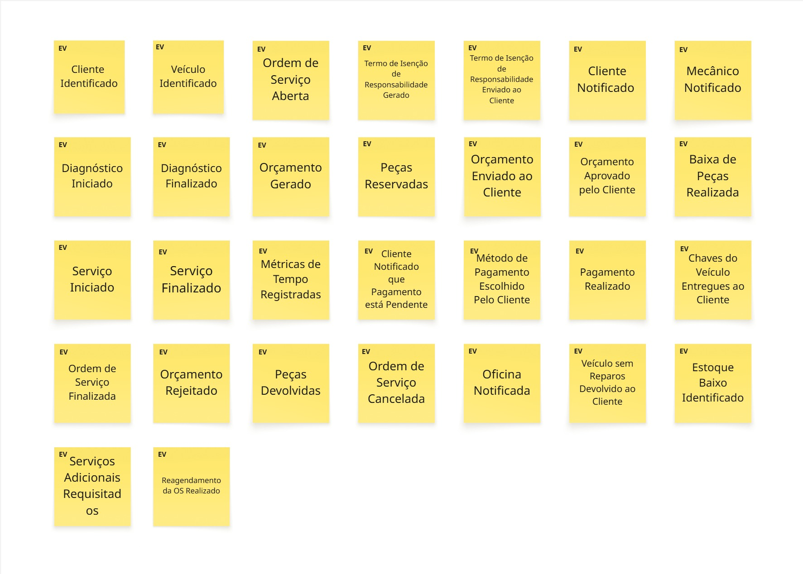
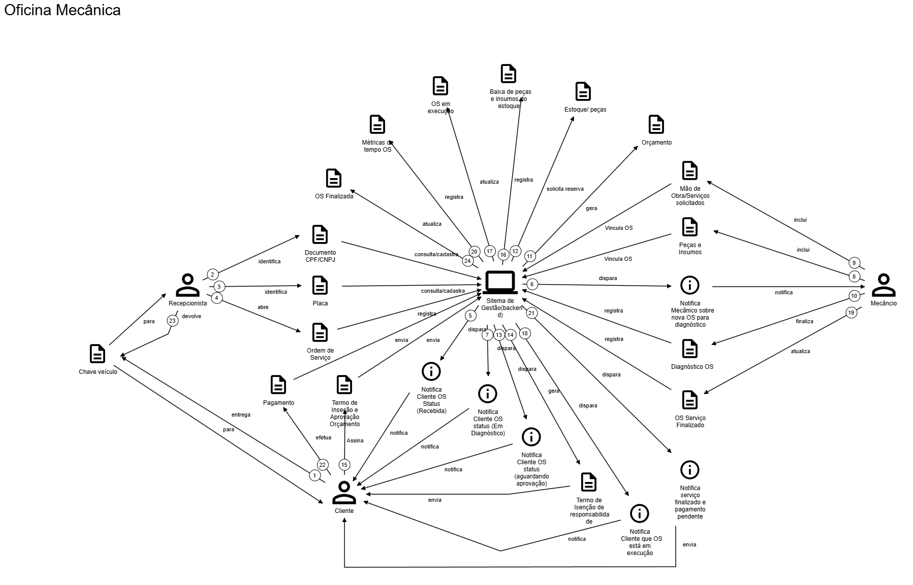
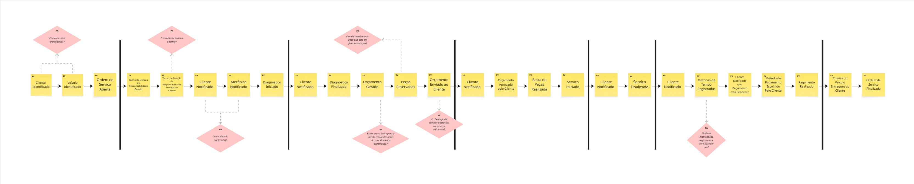
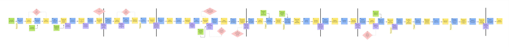
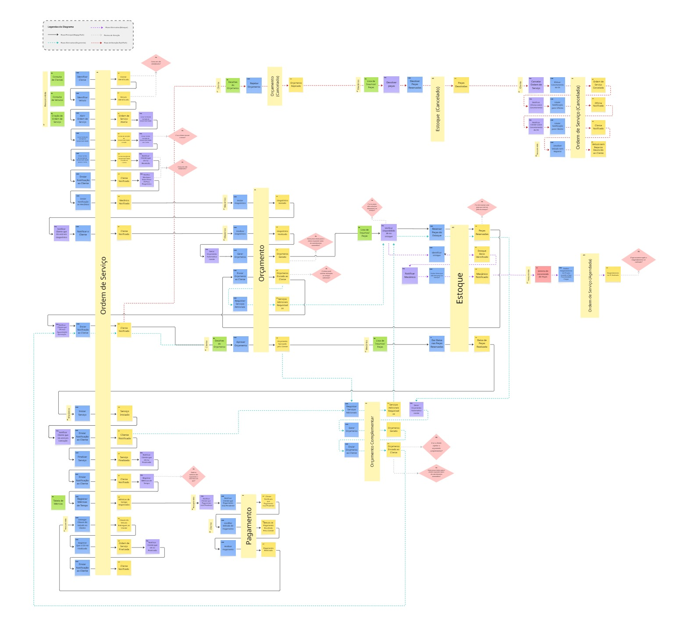

# Documentação de Negócio do AutoFlow


_Visão do domínio, dos subdomínios e das regras de negócio identificadas no sistema atual._

---

## 🗄️ Seções do Documento

| Seção | Subseções |
| --- | --- |
| [🎯 Visão do Negócio](#-visão-do-negócio) | [Objetivo](#objetivo-do-negócio), [Domínio](#domínio-e-subdomínios) |
| [🎭 Atores e Fluxos](#-atores-e-fluxos) | [Atores](#atores-do-processo), [Fluxos](#fluxos-principais) |
| [🧠 Descoberta do Domínio](#-descoberta-do-domínio) | [Brainstorming](#brainstorming), [Storytelling](#domain-storytelling), [Linha do Tempo](#linha-do-tempo), [Eventos Pivotais](#eventos-pivotais), [Event Storming](#event-storming) |
| [💼 Regras de Negócio](#-regras-de-negócio) | [Regras](#regras-de-negócio-relevantes), [Observações](#observações-de-negócio) |
| [📚 Referência](#-referência) | [Linguagem Ubíqua](#linguagem-ubíqua), [Resumo](#resumo-do-domínio) |

---

## 🎯 Visão do Negócio

### Objetivo do Negócio

O AutoFlow é um sistema de gestão operacional para oficinas mecânicas. A Ordem de Serviço é o elemento central do processo e reúne diagnóstico, orçamento, execução, pagamento e entrega do veículo.

Ele tem como propósito:

- **Centralizar** o ciclo de vida da Ordem de Serviço;
- **Controlar** o fluxo entre recebimento, diagnóstico, aprovação, execução e entrega;
- **Apoiar** a gestão de estoque, orçamento, pagamento e histórico operacional;
- **Fornecer** histórico e métricas para acompanhamento operacional.

### Domínio e Subdomínios

**Subdomínio Principal**

- **Gestão da ordem de serviço e do atendimento automotivo**
    - A Ordem de Serviço representa a unidade central do atendimento e integra cliente, veículo, diagnóstico, orçamento, execução, pagamento e entrega.

**Subdomínios Genéricos:** 

- **Cadastro e gestão operacional**
    - Clientes;
    - Veículos;
    - Funcionários;
    - Serviços;
    - Histórico por veículo.

- **Gestão financeira do atendimento**
    - Orçamento;
    - Aprovação e recusa;
    - Cálculo de valores;
    - Cobrança e status de pagamento;
    - Taxa de permanência.

**Subdomínios de Suporte**

- **Estoque e peças**
    - Controle de itens;
    - Reserva de peças;
    - Baixa e cancelamento de estoque;
    - Alerta de estoque baixo de peças compartilhadas.

- **Operação e acompanhamento**
    - Agendamento;
    - Fila virtual;
    - Métricas de tempo;
    - Status de execução;
    - Regras agendadas de cancelamento e abandono técnico.

---

## 🎭 Atores e Fluxos

### Atores do Processo

| Papel | Descrição |
| --- | --- |
| Recepcionista | Responsável pela operação administrativa da oficina, atendimento e acompanhamento operacional. No sistema, utiliza o perfil administrativo. |
| Mecânico/Funcionário | Realiza diagnóstico, acompanha a execução da OS e pode ser alocado a uma Ordem de Serviço. |
| Cliente | Aprova ou recusa orçamentos e acompanha o estado do atendimento. |

### Fluxos Principais

**Fluxo da OS**

```text
RECEBIDA
  ↓
EM_DIAGNOSTICO
  ↓
AGUARDANDO_APROVACAO
  ↓
ORCAMENTO_APROVADO
  ↓
EM_EXECUCAO
  ↓
FINALIZADA
  ↓
ENTREGUE
```

**Fluxo de Orçamento**

```text
PENDENTE
  ↓
APROVADO / RECUSADO / EXPIRADO / CANCELADO
```

**Fluxo de Execução e Estoque**

- O orçamento gera serviços e itens necessários para a execução;
- Itens podem ser reservados antes da execução do serviço;
- Após a aprovação, os itens utilizados recebem baixa no estoque;
- Se o orçamento for recusado, os itens reservados retornam ao estoque;
- A reserva permanece vinculada enquanto a OS estiver ativa.

---

## 🧠 Descoberta do Domínio

A descoberta do domínio foi realizada antes da modelagem detalhada da solução, permitindo identificar processos, atores, eventos e regras relevantes para o negócio. **A documentação completa pode ser vista através do [Miro do projeto](https://miro.com/app/board/uXjVH7ifFEw=/?share_link_id=371619344967).**

### Brainstorming

<p>
  
</p>

### Domain Storytelling

<p>
  
</p>

### Linha do Tempo

A linha do tempo organiza cronologicamente os principais acontecimentos do atendimento, desde a identificação do cliente e do veículo até a entrega.

<p>
  
</p>

### Eventos Pivotais

Os eventos pivotais foram utilizados para identificar os principais acontecimentos do fluxo da Ordem de Serviço antes do detalhamento realizado no Event Storming.

<p>
  
</p>

### Event Storming

O Event Storming foi utilizado para detalhar o comportamento do domínio a partir dos eventos, comandos, políticas, atores, modelos de leitura e agregados.

Os principais agregados identificados foram:

- **Ordem de Serviço;**
- **Orçamento;**
- **Estoque;**
- **Orçamento Complementar;**
- **Pagamento.**

Também foram identificados fluxos alternativos relacionados ao **orçamento complementar e ao estoque**.

<p>
  
</p>

---

## 💼 Regras de Negócio


| Identificador | Regra                     | Descrição                                                                                                                            |
| ------------- | ------------------------- | ------------------------------------------------------------------------------------------------------------------------------------ |
| RN-01         | Serviço duplicado         | A Ordem de Serviço não pode possuir o mesmo serviço mais de uma vez na execução.                                                     |
| RN-02         | Mecânico único por vez    | Um mecânico atende uma OS por vez e não pode ser alocado simultaneamente em outra enquanto estiver ocupado.                          |
| RN-03         | Orçamento obrigatório     | Para avançar após o diagnóstico, deve existir orçamento vinculado ao atendimento.                                                    |
| RN-04         | Entrega bloqueada         | A OS só pode ser entregue quando não houver pendência de pagamento.                                                                  |
| RN-05         | Status do orçamento       | Apenas orçamentos pendentes e não expirados podem ser aprovados ou recusados.                                                        |
| RN-06         | Recálculo financeiro      | O valor total do orçamento é calculado com base em mão de obra e itens associados.                                                   |
| RN-07         | Aprovação do cliente      | O cliente pode consultar os detalhes e aprovar ou recusar o orçamento.                                                               |
| RN-08         | Orçamento complementar    | Um orçamento complementar só pode ser criado após a existência de um orçamento inicial.                                              |
| RN-09         | Pausa de complementar     | Quando um orçamento complementar é gerado, a OS aguarda a decisão do cliente.                                                        |
| RN-10         | Expiração do complementar | O orçamento complementar possui prazo de 24 horas para aceite ou recusa.                                                             |
| RN-11         | Retorno de estoque        | Se o cliente recusa o orçamento, os itens reservados são devolvidos ao estoque.                                                      |
| RN-12         | Reserva ativa             | A reserva de itens permanece vinculada enquanto a OS estiver ativa.                                                                  |
| RN-13         | Limite do pátio           | Quando o limite operacional é atingido, a oficina deixa de receber veículos sem agendamento. O limite implementado é de 15 veículos. |
| RN-14         | Peça encomendada          | Quando uma peça precisa ser encomendada, a OS pode ser suspensa até a disponibilidade do material.                                   |
| RN-15         | Histórico por veículo     | O histórico de manutenções e atendimentos deve poder ser consultado pelo veículo.                                                    |
| RN-16         | Cancelamento automático   | Uma rotina diária às 08:00 verifica orçamentos pendentes e aplica a regra de cancelamento quando o prazo é excedido.                 |
| RN-17         | Abandono técnico          | Uma rotina diária às 09:00 verifica pendências prolongadas e pode marcar a situação como abandono técnico.                           |
| RN-18         | Métricas de tempo         | O sistema registra métricas relacionadas ao diagnóstico, execução e finalização da OS.                                               |
| RN-19         | Estoque crítico           | O sistema possui controle de quantidade mínima e gera alertas quando o estoque atinge o limite configurado.                          |
                                                                                         

### Observações de Negócio

**O que está como evolução futura:**

- Integração com gateway externo de pagamento;
- Integração automatizada de notificações para cliente e mecânico;
- Integração de canais externos de comunicação.

**Regras em evolução:**
- As rotinas de cancelamento e abandono técnico estão implementadas e executadas por agendamento. Os prazos e a política de comunicação podem ser ajustados futuramente conforme evolução ou validação das regras do negócio.

---

## 📚 Referência

### Linguagem Ubíqua

| Termo                  | Significado                                                      |
| ---------------------- | ---------------------------------------------------------------- |
| Ordem de Serviço       | Unidade central do atendimento e da execução da oficina.         |
| Diagnóstico            | Registro técnico sobre o problema identificado no veículo.       |
| Orçamento              | Proposta financeira e técnica para o atendimento.                |
| Orçamento complementar | Alteração ou adição ao orçamento inicial.                        |
| Serviço                | Ação planejada ou executada sobre o veículo.                     |
| Reserva de estoque     | Separação temporária de item para o atendimento.                 |
| Entrega                | Encerramento do atendimento com devolução do veículo.            |
| Cancelamento           | Encerramento da OS por regra de negócio ou decisão operacional.  |
| Abandono técnico       | Situação de pendência prolongada da OS.                          |
| Pagamento              | Situação financeira da Ordem de Serviço e critério para entrega. |


### Resumo do Domínio

O AutoFlow gerencia o ciclo operacional de atendimento de uma oficina mecânica, tendo a Ordem de Serviço como elemento central do processo.

A partir dela, o sistema integra diagnóstico, orçamento, estoque, execução, pagamento, entrega e histórico do veículo.

---
