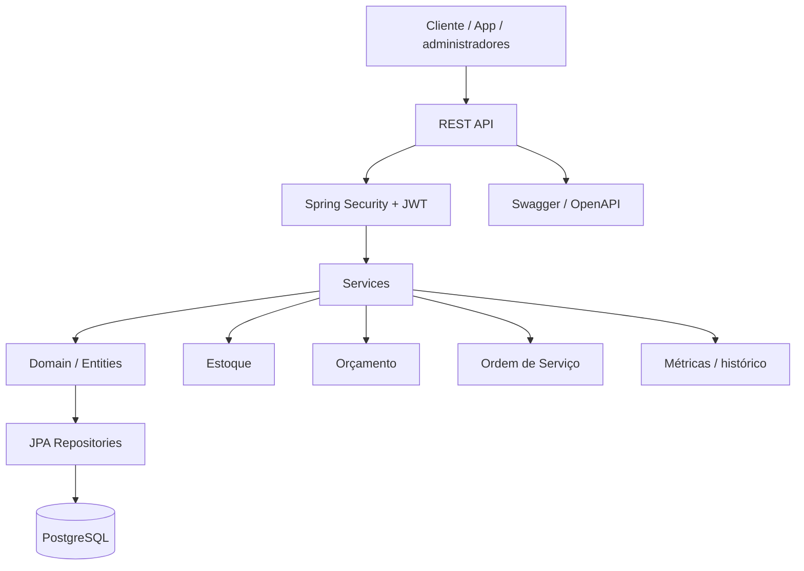

# DAS - Documentação de Arquitetura de Software


_Resumo técnico da arquitetura implementada no AutoFlow, com representação da estrutura de software e dos principais fluxos._

---

## 🗄️ Seções do Documento

| Seção                                                   | Subseções                                                                   |
| ------------------------------------------------------- | --------------------------------------------------------------------------- |
| [🎯 Objetivo e Visão](#-objetivo-e-visão)               | [Objetivo](#objetivo), [Visão arquitetural](#visão-arquitetural)            |
| [🏗️ Estrutura e Componentes](#-estrutura-e-componentes) | [Estrutura](#estrutura-de-software), [Componentes](#componentes-principais) |
| [📊 Fluxos e Padrões](#-fluxos-e-padrões)               | [Diagrama](#diagrama-arquitetural), [Padrões](#padrões-observados)          |
| [⚠️ Atenção e Conclusão](#-atenção-e-conclusão)         | [Pontos de atenção](#pontos-de-atenção), [Conclusão](#conclusão)            |

---

## 🎯 Objetivo e Visão

### Objetivo

A DAS documenta a arquitetura software do sistema atual, destacando a estrutura, os principais componentes, as decisões de design e os pontos de atenção observados no projeto.

### Visão arquitetural

O AutoFlow é um monólito modular em Java com Spring Boot. A organização do código reflete separação clara entre:

- domínio;
- aplicação;
- infraestrutura;
- interfaces REST;
- tratamento de erros e segurança.

**Pilha tecnológica:**

- Java 25;
- Spring Boot 4.1.0;
- Spring MVC;
- Spring Data JPA;
- PostgreSQL;
- Spring Security;
- JWT;
- Lombok;
- MapStruct;
- Springdoc OpenAPI;
- Maven;
- Docker / Docker Compose;
- SonarQube;
- JaCoCo.

---

## 🏗️ Estrutura e Componentes

### Estrutura de software

```text
src/
├── main/java/br/com/autoflow/
│   ├── application/
│   │   ├── dto/
│   │   ├── service/
│   │   └── validator/
│   ├── domain/
│   │   ├── enums/
│   │   ├── model/
│   │   └── repository/
│   ├── exception/
│   ├── infrastructure/
│   │   ├── mapper/
│   │   └── security/
│   └── interfaces/
│       └── controller/
├── test/java/
├── Dockerfile
├── docker-compose.yml
├── pom.xml
├── ARCHITECTURE.md
└── README.md
```

### Componentes principais

#### Camada de domínio

Responsável por entidades e regras centrais do problema:

- `OrdemServico`
- `Orcamento`
- `Estoque`
- `Veiculo`
- `Funcionario`
- `Servico`
- enums de status e pagamentos

#### Camada de aplicação

Responsável por orquestrar casos de uso e regras de negócio:

- `OrdemServicoService`
- `OrcamentoService`
- `EstoqueService`
- `FuncionarioService`
- `VeiculoService`
- validadores específicos

#### Camada de infraestrutura

Responsável por adaptação técnica e infraestrutura do sistema:

- Spring Security
- JWT filters
- JPA repositories
- mappers
- integração com banco e configuração externa

#### Camada de interfaces

Responsável pela exposição REST e entrada de dados:

- controllers de autenticação, ordem de serviço, orçamento, estoque e veículos

---

## 📊 Fluxos e Padrões

### Diagrama arquitetural



### Padrões observados

- monólito modular;
- arquitetura em camadas;
- uso de serviço para orquestração de regras;
- entidades ricas com regras de status e validação;
- repository pattern com JPA;
- segurança por perfil e token JWT;
- exception handling centralizado;
- agendamento para processos recorrentes.

---

## ⚠️ Atenção e Conclusão

### Pontos de atenção

- o projeto depende de variáveis de ambiente para datasource e JWT;
- o arquivo de configuração externo não está versionado no repositório;
- a autenticação e autorização estão implementadas, mas não há, no código atual, uma camada avançada de governança de segredos ou rate limiting;
- a camada de pagamento externo e notificações ainda está em evolução e não é parte da implementação principal atual.

### Conclusão

A arquitetura atual do AutoFlow é apropriada para um sistema de gestão operacional de oficina. Ela combina um monólito bem organizado com domínio claro, regras de transformação de status, estoque e execução, e uma infraestrutura moderna com Spring Boot, PostgreSQL e JWT.

A estrutura e os diagramas apresentados nesta DAS estão alinhados ao que está realmente implementado no código e no conjunto de serviços do projeto.

---
