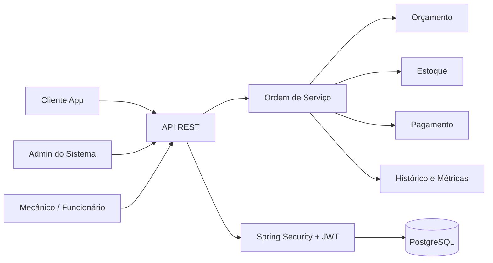

# HLD - High Level Design


_Visão de alto nível da arquitetura do AutoFlow, com foco na estrutura do sistema e nos principais fluxos de negócio._

---

## 🗄️ Seções do Documento

| Seção                                               | Subseções                                                                                                                              |
| --------------------------------------------------- | -------------------------------------------------------------------------------------------------------------------------------------- |
| [🎯 Objetivo e Visão](#-objetivo-e-visão)           | [Objetivo](#objetivo-do-hld), [Visão geral](#visão-geral)                                                                              |
| [🏗️ Blocos de Arquitetura](#-blocos-de-arquitetura) | [Interface](#interface-de-acesso), [Aplicação](#camada-de-aplicação), [Domínio](#camada-de-domínio), [Infraestrutura](#infraestrutura) |
| [📊 Fluxo e Dependências](#-fluxo-e-dependências)   | [Diagrama](#diagrama-de-alto-nível), [Tecnologias](#tecnologias-principais)                                                            |
| [⚠️ Riscos e Conclusão](#-riscos-e-conclusão)       | [Observações](#riscos-e-observações), [Conclusão](#conclusão)                                                                          |

---

## 🎯 Objetivo e Visão

### Objetivo do HLD

Este documento descreve a arquitetura macro do sistema, sem entrar na profundidade de classes e implementações específicas. O objetivo é mostrar como o sistema se organiza para atender o ciclo completo de oficina mecânica.

### Visão geral

O AutoFlow é um monólito modular em Java com Spring Boot. A aplicação concentra os fluxos principais em torno da ordem de serviço, que conecta cliente, veículo, mecânico, estoque, orçamento e pagamentos.

**Observação:**

A arquitetura foi modelada para manter um único processo operacional centralizado, sem o excesso de complexidade de microsserviços na primeira fase do sistema.

---

## 🏗️ Blocos de Arquitetura

### Interface de acesso

- controllers REST;
- endpoints de autenticação;
- endpoints de operação da oficina;
- documentação OpenAPI/Swagger.

### Camada de aplicação

- serviços de negócio;
- regras de transição de status;
- validação de orçamento e pagamento;
- processamento de estoque;
- métricas e histórico.

### Camada de domínio

- entidades do sistema;
- enums de status;
- regras de transição;
- lógica de negócio do atendimento.

### Infraestrutura

- JPA e PostgreSQL;
- segurança com Spring Security + JWT;
- mapper de entidades;
- tratamento centralizado de erros;
- agendamento de processos automáticos.

---

## 📊 Fluxo e Dependências

### Diagrama de alto nível



### Fluxo principal do negócio

```text
Abertura da OS
  ↓
Diagnóstico
  ↓
Orçamento pendente
  ↓
Aprovação / recusa do cliente
  ↓
Execução do serviço
  ↓
Finalização
  ↓
Pagamento / entrega
```

### Tecnologias principais

- Java 25;
- Spring Boot 4.1.0;
- Spring Data JPA;
- PostgreSQL;
- Spring Security;
- JWT;
- OpenAPI;
- Docker;
- SonarQube.

**Fatores arquiteturais relevantes:**

- transações e histórico em banco relacional;
- regras de negócio centralizadas em domínio e serviços;
- autenticação sem estado;
- uso de agendamento para controlar pendências e regras automáticas;
- organização modular em pacotes para facilitar manutenção.

---

## ⚠️ Riscos e Conclusão

### Riscos e observações

- a integração externa de pagamento ainda está como evolução futura;
- a comunicação de notificação automática ainda não é a implementação completa do sistema;
- a configuração de datasource e secret JWT depende de ambiente externo;
- a regra de quantidade mínima de estoque é um ponto ainda não tratado como regra concluída.

### Conclusão

O HLD do AutoFlow descreve um sistema focado em fluxo operacional de oficina, com arquitetura coerente para gestão de ordens de serviço, estoque, orçamento e pagamento. A estrutura favorece manutenção e crescimento incremental, mantendo o núcleo em um monólito modular bem definido.

---
