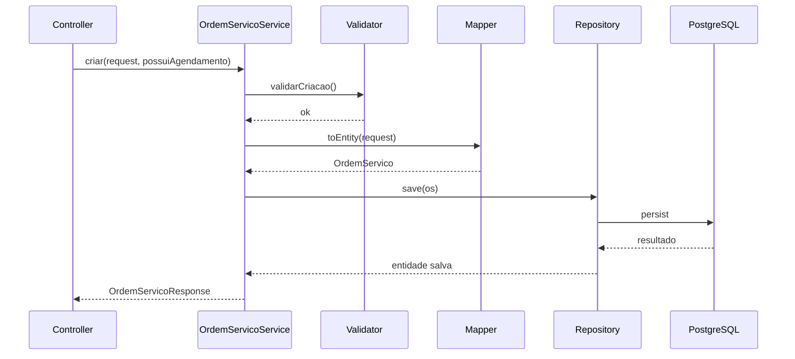
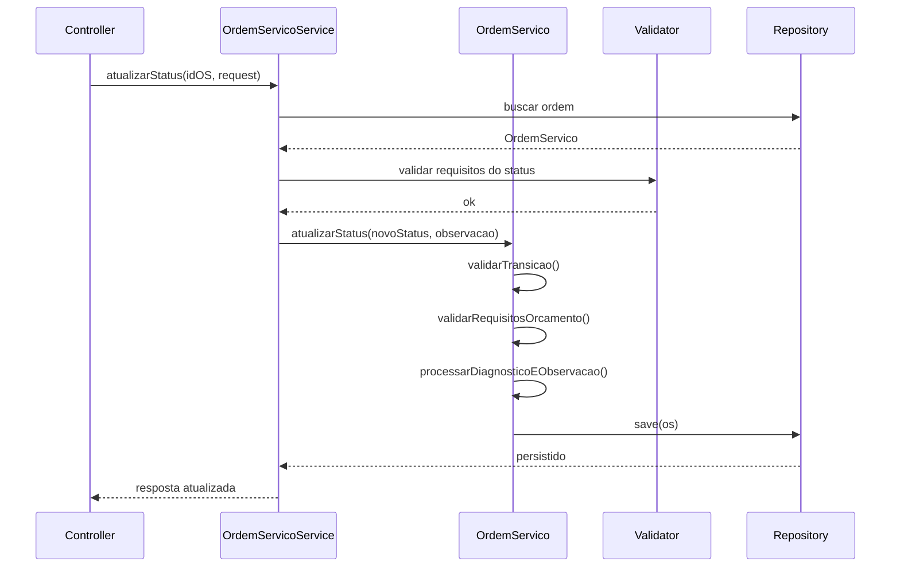

# LLD - Low Level Design

_Design de baixo nível do AutoFlow, com foco nas classes, fluxos e regras implementadas na aplicação atual._

---

## 🗄️ Seções do Documento

| Seção                                     | Subseções                                                                                                    |
| ----------------------------------------- | ------------------------------------------------------------------------------------------------------------ |
| [🎯 Visão Geral](#-visão-geral)           | [Objetivo](#objetivo), [Classes principais](#visão-geral-das-classes-principais)                             |
| [📊 Fluxos](#-fluxos)                     | [Criação de OS](#fluxo-principal-de-criação-de-os), [Atualização de status](#fluxo-de-atualização-de-status) |
| [💼 Regras de Design](#-regras-de-design) | [Validação](#regras-implementadas-no-nível-de-design), [Observações](#observações-técnicas-relevantes)       |
| [✅ Conclusão](#-conclusão)               | [Resumo](#conclusão)                                                                                         |

---

## 🎯 Visão Geral

### Objetivo

Este documento detalha como o sistema implementa as regras do domínio, ao nível de serviços, entidades, controladores e operações automatizadas.

### Visão geral das classes principais

#### Controllers

- `AutenticacaoController`
- `OrdemServicoController`
- `OrcamentoController`
- `VeiculoController`
- `FuncionarioController`
- `ServicoController`
- `EstoqueController`

#### Serviços

- `OrdemServicoService`
- `OrcamentoService`
- `FuncionarioService`
- `VeiculoService`
- `EstoqueService`
- `ServicoService`
- validadores de criação/alteração de fluxo

#### Entidades relevantes

- `OrdemServico`
- `Orcamento`
- `OrcamentoServico`
- `OrcamentoItem`
- `OsServico`
- `Funcionario`
- `Veiculo`
- `Estoque`
- `Usuario`

---

## 📊 Fluxos

### Fluxo principal de criação de OS

### Fluxo de atualização de status

---

## 💼 Regras de Design

### Regras implementadas no nível de design

#### Validação de transição

A entidade `StatusOS` define as transições possíveis entre os estados do atendimento. A lógica de `podeTransitarPara` impede mudanças inválidas.

#### Orçamento como critério de progresso

Antes de avançar para etapas após diagnóstico, a ordem exige pelo menos um orçamento vinculado. Isso aparece em `OrdemServico.validarRequisitosOrcamento`.

#### Entrega bloqueada por pendência de pagamento

Ao tentar encerrar em `ENTREGUE`, a entidade valida se o pagamento está pendente; se estiver, a transição é recusada.

#### Recalculo de valores do orçamento

A entidade `Orcamento` recalcula subtotal, mão de obra e total em `@PrePersist` e `@PreUpdate`.

#### Serviços aprovados entram na execução sem duplicidade

`OrdemServico.carregarServicosDosOrcamentosAprovados` evita duplicação ao carregar serviços em execução.

#### Processos agendados

- `processarCancelamentosAutomaticos` executa diariamente às 08:00;
- `processarAbandonoTecnico` executa diariamente às 09:00;
- ambos usam `@Scheduled` para varredura de pendências.

### Observações técnicas relevantes

- `@PrePersist` e `@PreUpdate` são usados para recalcular e preencher campos essenciais;
- `GlobalExceptionHandler` padroniza respostas de erro da API;
- `SecurityFilter` intercepta token e protege rotas por perfil;
- `FuncionaioRepository` e `OrdemServicoRepository` são parte do núcleo da dinâmica de carga de mecânico e status;
- o modelo usa listas e relacionamentos JPA para manter consistência do negócio.

---

## ✅ Conclusão

O LLD do AutoFlow mostra um sistema com regras bem distribuídas entre domínio e serviços. A arquitetura local da aplicação favorece consistência e controle de regras de negócio, especialmente em transições de status, alocação de mecânico, orçamento e estoque.

---
